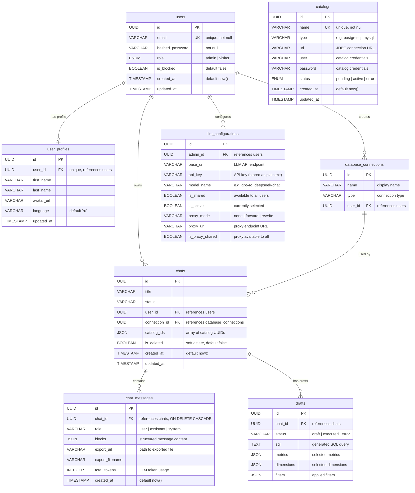

# Database Schema

NLEx uses **PostgreSQL 15+** as its primary data store. The schema is relatively compact — eight core tables covering users, catalogs, chats, and configuration.

---

## Entity-Relationship Diagram



---

## Table Descriptions

### `users`

Core authentication table. Every person interacting with NLEx has a row here.

| Column | Type | Constraints | Description |
|---|---|---|---|
| `id` | `UUID` | PK, default `gen_random_uuid()` | Unique user identifier |
| `email` | `VARCHAR` | UNIQUE, NOT NULL | Login email address |
| `hashed_password` | `VARCHAR` | NOT NULL | Bcrypt-hashed password |
| `role` | `ENUM('admin','visitor')` | NOT NULL | Determines UI capabilities and API access |
| `is_blocked` | `BOOLEAN` | default `false` | Admin can block a user to revoke access |
| `created_at` | `TIMESTAMP` | default `now()` | Registration timestamp |
| `updated_at` | `TIMESTAMP` | | Last profile/password change |

!!!note "Role semantics"
    **admin** — can manage catalogs, users, LLM configurations, and database connections.
    **visitor** — can chat, create drafts, and export results.

---

### `user_profiles`

Extended profile data separated from auth to keep the `users` table lean.

| Column | Type | Constraints | Description |
|---|---|---|---|
| `id` | `UUID` | PK | Profile identifier |
| `user_id` | `UUID` | FK → `users`, UNIQUE | One-to-one link to the user |
| `first_name` | `VARCHAR` | | Display first name |
| `last_name` | `VARCHAR` | | Display last name |
| `avatar_url` | `VARCHAR` | | URL or path to the avatar image |
| `language` | `VARCHAR` | default `'ru'` | UI language preference |
| `updated_at` | `TIMESTAMP` | | Last profile update |

---

### `catalogs`

Represents a Trino catalog — a data source that NLEx can query.

| Column | Type | Constraints | Description |
|---|---|---|---|
| `id` | `UUID` | PK | Catalog identifier |
| `name` | `VARCHAR` | UNIQUE, NOT NULL | Trino catalog name (must match the `.properties` file) |
| `type` | `VARCHAR` | | Connector type (`postgresql`, `mysql`, `clickhouse`, etc.) |
| `url` | `VARCHAR` | | JDBC connection URL for the external database |
| `user` | `VARCHAR` | | Username for the external database |
| `password` | `VARCHAR` | | Password for the external database |
| `status` | `ENUM` | | `pending` → `active` or `error` after health check |
| `created_at` | `TIMESTAMP` | default `now()` | When the catalog was registered |
| `updated_at` | `TIMESTAMP` | | Last status/config change |

!!!warning "Security: plaintext credentials"
    The `user` and `password` columns store external database credentials **in plaintext**. This is a known limitation — see the [Security Notes](#security-notes) section below.

---

### `chats`

A conversation session between a user and the LLM.

| Column | Type | Constraints | Description |
|---|---|---|---|
| `id` | `UUID` | PK | Chat identifier |
| `title` | `VARCHAR` | | Auto-generated or user-defined title |
| `status` | `VARCHAR` | | Current chat state |
| `user_id` | `UUID` | FK → `users` | Owner of the chat |
| `connection_id` | `UUID` | FK → `database_connections` | Active database connection for this chat |
| `catalog_ids` | `JSON` | | Array of catalog UUIDs selected for querying |
| `is_deleted` | `BOOLEAN` | default `false` | Soft delete flag — chat is hidden but not purged |
| `created_at` | `TIMESTAMP` | default `now()` | Chat creation time |
| `updated_at` | `TIMESTAMP` | | Last activity timestamp |

---

### `chat_messages`

Individual messages within a chat. Cascade-deleted when the parent chat is removed.

| Column | Type | Constraints | Description |
|---|---|---|---|
| `id` | `UUID` | PK | Message identifier |
| `chat_id` | `UUID` | FK → `chats`, ON DELETE CASCADE | Parent chat |
| `role` | `VARCHAR` | | `user`, `assistant`, or `system` |
| `blocks` | `JSON` | | Structured content blocks (text, code, table, chart) |
| `export_url` | `VARCHAR` | | Path to the exported Excel/CSV file |
| `export_filename` | `VARCHAR` | | Original filename for download |
| `total_tokens` | `INTEGER` | | Token count for the LLM call |
| `created_at` | `TIMESTAMP` | default `now()` | Message timestamp |

!!!tip "Message blocks"
    The `blocks` JSON column supports multiple content types in a single message. A typical assistant response might contain a `text` block, a `sql` block, and a `table` block — all rendered sequentially in the UI.

---

### `drafts`

SQL drafts generated during a structured query-building flow.

| Column | Type | Constraints | Description |
|---|---|---|---|
| `id` | `UUID` | PK | Draft identifier |
| `chat_id` | `UUID` | FK → `chats` | Parent chat |
| `status` | `VARCHAR` | | `draft`, `executed`, or `error` |
| `sql` | `TEXT` | | The generated SQL statement |
| `metrics` | `JSON` | | Selected metrics (measures) |
| `dimensions` | `JSON` | | Selected dimensions (group-by columns) |
| `filters` | `JSON` | | Applied filter conditions |

---

### `database_connections`

Named database connections created by users. A chat is linked to one connection.

| Column | Type | Constraints | Description |
|---|---|---|---|
| `id` | `UUID` | PK | Connection identifier |
| `name` | `VARCHAR` | | Human-readable connection name |
| `type` | `VARCHAR` | | Connection type identifier |
| `user_id` | `UUID` | FK → `users` | Owner of the connection |

---

### `llm_configurations`

LLM provider settings managed by admins.

| Column | Type | Constraints | Description |
|---|---|---|---|
| `id` | `UUID` | PK | Configuration identifier |
| `admin_id` | `UUID` | FK → `users` | Admin who created this config |
| `base_url` | `VARCHAR` | | API endpoint (e.g., `https://api.openai.com/v1`) |
| `api_key` | `VARCHAR` | | API key — **stored in plaintext** |
| `model_name` | `VARCHAR` | | Model identifier (e.g., `gpt-4o`, `deepseek-chat`) |
| `is_shared` | `BOOLEAN` | | If `true`, all users can use this configuration |
| `is_active` | `BOOLEAN` | | Currently active configuration |
| `proxy_mode` | `VARCHAR` | | `none`, `forward`, or `rewrite` |
| `proxy_url` | `VARCHAR` | | URL of the proxy endpoint |
| `is_proxy_shared` | `BOOLEAN` | | If `true`, proxy is available to all users |

---

## Migration Strategy

!!!warning "No Alembic"
    NLEx does **not** use Alembic or any automated migration framework. Schema management is handled as follows:

**Auto-create on first start:**

The backend calls `Base.metadata.create_all(bind=engine)` during startup. If the database is empty, all tables are created automatically from the SQLAlchemy models.

**Schema changes:**

When the schema evolves, changes are applied via ad-hoc `ALTER TABLE` statements run manually or through init scripts:

```sql
-- Example: adding a new column
ALTER TABLE chats ADD COLUMN IF NOT EXISTS connection_id UUID REFERENCES database_connections(id);

-- Example: changing a default
ALTER TABLE user_profiles ALTER COLUMN language SET DEFAULT 'en';
```

**Implications:**

- There is no migration history or rollback capability.
- When deploying a new version with schema changes, you must manually verify and apply `ALTER TABLE` statements before restarting the backend.
- For fresh deployments, simply let `create_all()` build the schema from scratch.

---

## Security Notes

!!!warning "Critical: Secrets stored in plaintext"
    The following sensitive values are stored **unencrypted** in the database:

| Table | Column | Contains |
|---|---|---|
| `catalogs` | `password` | External database passwords |
| `llm_configurations` | `api_key` | LLM provider API keys |

**Recommendations for production deployments:**

1. **Restrict database access** — only the backend service should connect to PostgreSQL. Do not expose port `5432` outside the cluster.
2. **Use PostgreSQL `pgcrypto`** — encrypt sensitive columns with `pgp_sym_encrypt()` / `pgp_sym_decrypt()`.
3. **External secret managers** — consider HashiCorp Vault, AWS Secrets Manager, or Kubernetes Secrets for credentials that the backend reads at runtime.
4. **Audit access** — enable PostgreSQL audit logging (`pgaudit`) to track reads of sensitive tables.
5. **Rotate credentials** — periodically rotate database passwords and API keys, updating both the external service and the NLEx database.
