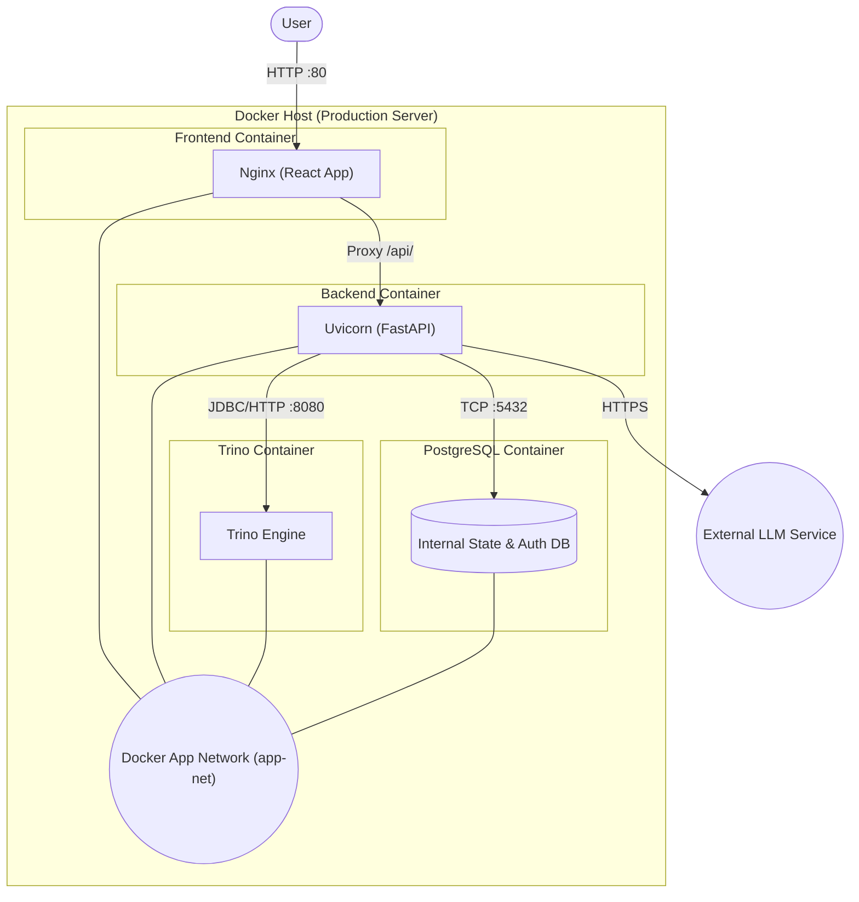

# Deployment View: Deployment Diagram

```mermaid
flowchart TD
    User([User])
    LLM(("External LLM Service"))

    subgraph Docker["Docker Host (Production Server)"]
        subgraph FrontendContainer["Frontend Container"]
            Nginx["Nginx (React App)"]
        end

        subgraph BackendContainer["Backend Container"]
            Uvicorn["Uvicorn (FastAPI)"]
        end

        subgraph TrinoContainer["Trino Container"]
            TrinoEngine["Trino Engine"]
        end

        subgraph PostgresContainer["PostgreSQL Container"]
            DB[("Internal State & Auth DB")]
        end
        
        AppNet(("Docker App Network (app-net)"))
    end

    User -- "HTTP :80" --> Nginx
    Nginx -- "Proxy /api/" --> Uvicorn
    Uvicorn -- "JDBC/HTTP :8080" --> TrinoEngine
    Uvicorn -- "TCP :5432" --> DB
    Uvicorn -- "HTTPS" --> LLM

    Nginx --- AppNet
    Uvicorn --- AppNet
    TrinoEngine --- AppNet
    DB --- AppNet
```
