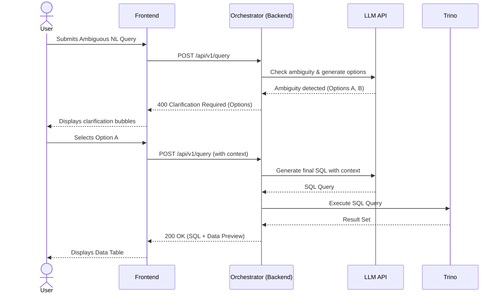

# Dynamic View: Sequence Diagram

```mermaid
sequenceDiagram
    actor User
    participant UI as Frontend
    participant Backend as Orchestrator (Backend)
    participant LLM as LLM API
    participant Trino as Trino

    User->>UI: Submits Ambiguous NL Query
    UI->>Backend: POST /api/v1/query
    Backend->>LLM: Check ambiguity & generate options
    LLM-->>Backend: Ambiguity detected (Options A, B)
    Backend-->>UI: 400 Clarification Required (Options)
    UI-->>User: Displays clarification bubbles

    User->>UI: Selects Option A
    UI->>Backend: POST /api/v1/query (with context)
    Backend->>LLM: Generate final SQL with context
    LLM-->>Backend: SQL Query
    Backend->>Trino: Execute SQL Query
    Trino-->>Backend: Result Set
    Backend-->>UI: 200 OK (SQL + Data Preview)
    UI-->>User: Displays Data Table
```
