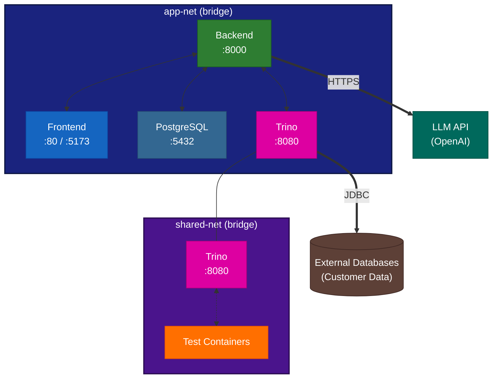
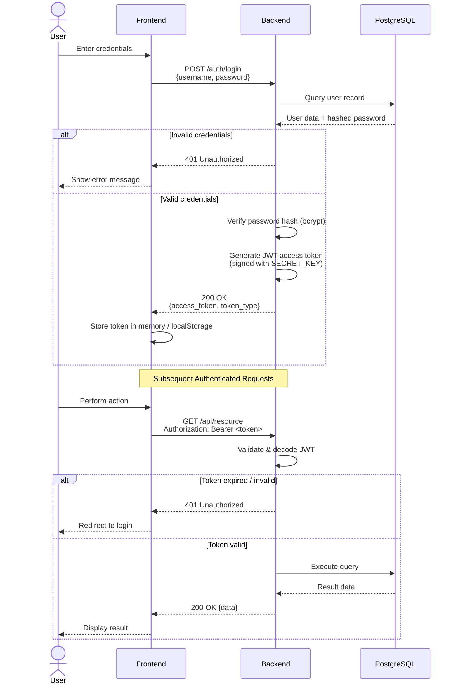

# Network & Communication Architecture

This document describes the network topology, inter-service communication protocols, port mappings, CORS configuration, and authentication flow for the NLEx platform.

---

## Network Topology

NLEx uses two Docker networks to isolate traffic and control service visibility.



### Network Definitions

| Network       | Driver  | Services                    | Purpose                                                    |
|---------------|---------|-----------------------------|------------------------------------------------------------|
| `app-net`     | bridge  | Frontend, Backend, PostgreSQL, Trino | Primary application network — all service-to-service traffic |
| `shared-net`  | bridge  | Trino, Test Containers      | Shared network for integration testing; Trino connects to test database containers |

!!! note "Dual-Network Attachment"
    Trino is attached to **both** `app-net` and `shared-net`. This allows the Backend to reach Trino on `app-net`, while test containers on `shared-net` can register themselves as Trino catalogs during integration tests.

---

## Communication Protocols

### Internal Service Communication

| Source    | Destination  | Protocol          | Library / Driver   | Description                                      |
|-----------|-------------|-------------------|--------------------|--------------------------------------------------|
| Frontend  | Backend     | HTTP REST         | `fetch` / `axios`  | API calls for CRUD operations, queries, catalogs |
| Frontend  | Backend     | WebSocket         | Native WebSocket   | Real-time query progress and streaming results   |
| Backend   | PostgreSQL  | PostgreSQL wire   | `asyncpg`          | Async queries (application runtime)              |
| Backend   | PostgreSQL  | PostgreSQL wire   | `psycopg2`         | Sync queries (migrations, startup tasks)         |
| Backend   | Trino       | HTTP REST         | `trino` (Python client) | Query execution against external data sources |

### External Communication

| Source | Destination      | Protocol | Library / Driver        | Description                                  |
|--------|-----------------|----------|-------------------------|----------------------------------------------|
| Backend | LLM (OpenAI)  | HTTPS    | `openai` Python client  | Natural language to SQL translation          |
| Trino   | External DBs   | JDBC     | Connector-specific driver | Dynamic catalog connections to customer databases |

!!! tip "Trino Connector Drivers"
    Trino uses built-in JDBC connectors for each database type (PostgreSQL, MySQL, SQL Server, etc.). The appropriate connector is specified when creating a catalog via `CREATE CATALOG ... USING <connector>`. No additional driver installation is required — connectors are bundled with the Trino image.

---

## Port Map

### Internal Ports (Container-to-Container)

| Service    | Port | Protocol        | Network    | Accessible By               |
|------------|------|-----------------|------------|------------------------------|
| Frontend   | 80   | HTTP            | app-net    | Reverse proxy / load balancer |
| Backend    | 8000 | HTTP / WebSocket | app-net   | Frontend, health checks       |
| PostgreSQL | 5432 | TCP             | app-net    | Backend only                  |
| Trino      | 8080 | HTTP            | app-net, shared-net | Backend, test containers |

### Host-Mapped Ports (Development)

| Service    | Container Port | Host Port | Purpose                            |
|------------|---------------:|-----------:|------------------------------------|
| Frontend   | 5173           | 5173      | Vite dev server with HMR           |
| Backend    | 8000           | 8000      | API access from host browser       |
| PostgreSQL | 5432           | 5432      | Database access from host tools    |
| Trino      | 8080           | 8080      | Trino UI and API from host browser |

!!! warning "Production Port Exposure"
    In production, **only the Frontend (port 80)** should be exposed to the public network, typically behind a reverse proxy (nginx, Traefik, or a cloud load balancer). PostgreSQL and Trino ports must **never** be exposed to the public internet.

---

## CORS Configuration

Cross-Origin Resource Sharing (CORS) is configured on the **Backend** service to allow the Frontend to make API requests.

### Configuration

| Parameter            | Value                                | Description                              |
|----------------------|--------------------------------------|------------------------------------------|
| `allow_origins`      | Value of `CORS_ORIGINS` env var      | Allowed origin URLs                      |
| `allow_credentials`  | `true`                               | Allow cookies / auth headers             |
| `allow_methods`      | `["*"]`                              | All HTTP methods permitted               |
| `allow_headers`      | `["*"]`                              | All headers permitted                    |

### Environment-Specific Origins

| Environment  | `CORS_ORIGINS` Value                        |
|-------------|----------------------------------------------|
| Development | `["http://localhost:5173"]`                   |
| Staging     | `["https://staging.nlex.example.com"]`        |
| Production  | `["https://nlex.example.com"]`                |

```python
# Backend CORS middleware setup (FastAPI)
from fastapi.middleware.cors import CORSMiddleware

app.add_middleware(
    CORSMiddleware,
    allow_origins=settings.CORS_ORIGINS,
    allow_credentials=True,
    allow_methods=["*"],
    allow_headers=["*"],
)
```

!!! warning "Wildcard Origins"
    Never use `allow_origins=["*"]` in production when `allow_credentials=True`. This is a security vulnerability. Always specify the exact origin(s) of your frontend deployment.

---

## Authentication Flow

NLEx uses JWT (JSON Web Token) based authentication with access tokens.

### Sequence Diagram



### Token Details

| Property        | Value                             |
|-----------------|-----------------------------------|
| Token type      | JWT (JSON Web Token)              |
| Algorithm       | HS256                             |
| Signing key     | `SECRET_KEY` environment variable |
| Token location  | `Authorization: Bearer <token>` header |
| Storage (client)| In-memory (recommended) or `localStorage` |

!!! tip "Token Security Best Practices"
    - Set a strong, random `SECRET_KEY` (minimum 32 characters).
    - Use short-lived access tokens (15–60 minutes) in production.
    - Store tokens in memory rather than `localStorage` to mitigate XSS attacks.
    - Implement token refresh endpoints for long-lived sessions.

### Protected Endpoints

All API endpoints under `/api/*` require a valid JWT token in the `Authorization` header, with the following exceptions:

| Endpoint          | Method | Authentication | Purpose            |
|-------------------|--------|----------------|--------------------|
| `/auth/login`     | POST   | None           | User login         |
| `/auth/register`  | POST   | None           | User registration  |
| `/`               | GET    | None           | Health check       |
| `/docs`           | GET    | None           | OpenAPI documentation |
