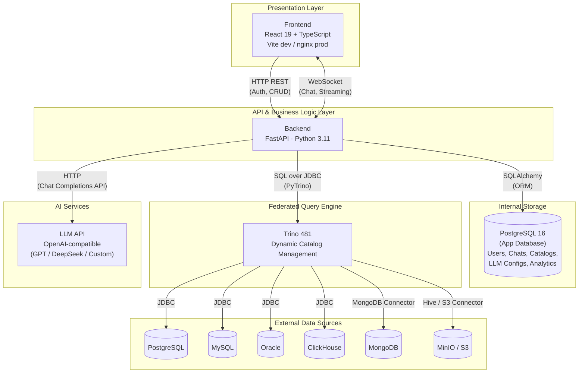
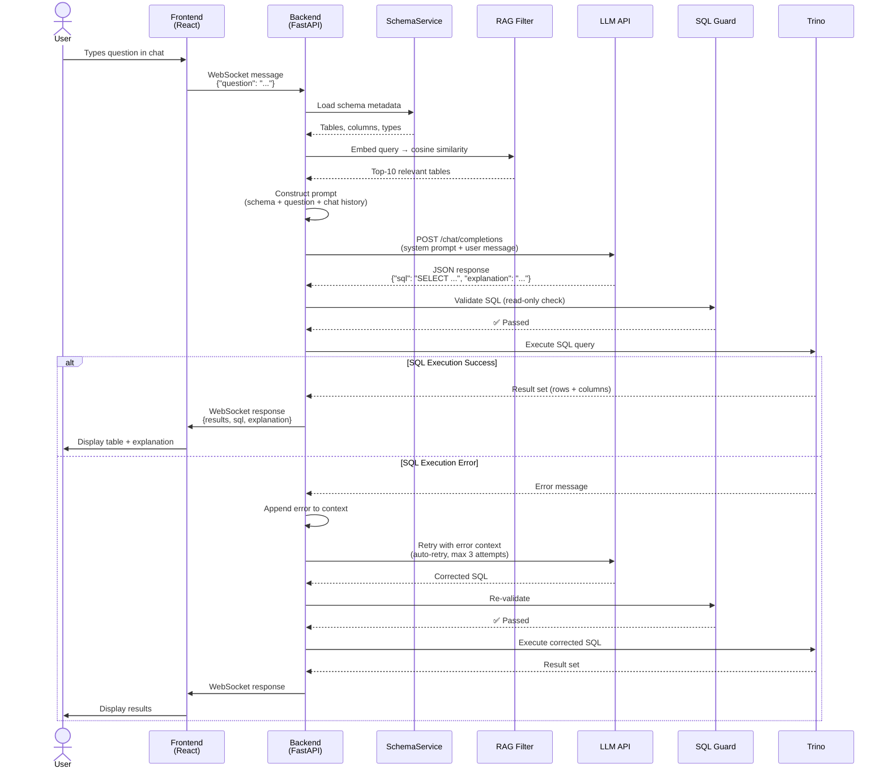
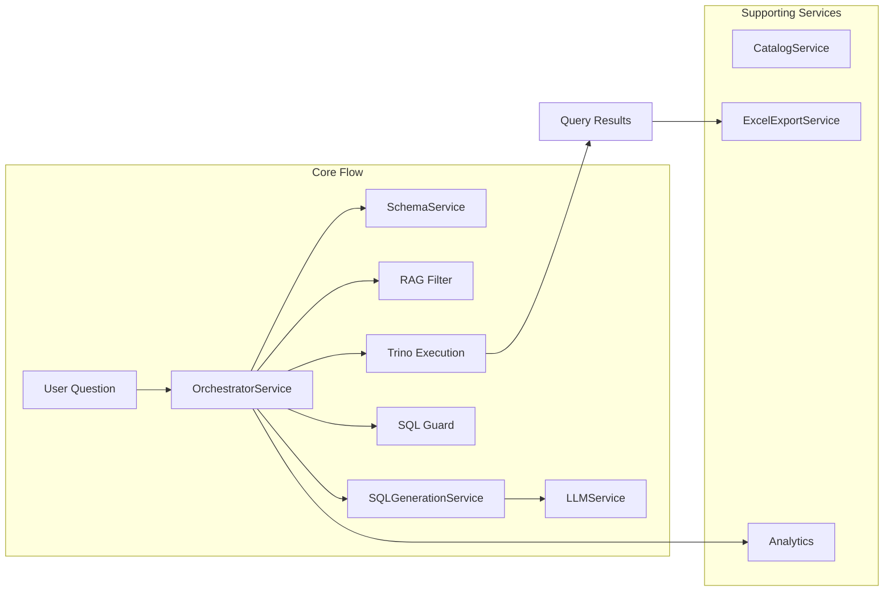

# Architecture Overview

This document describes the system architecture of NLEx, including component interactions, layered design, request lifecycle, and key design decisions.

---

## System Architecture Diagram

---

## Architecture Layers

NLEx follows a layered architecture pattern that separates concerns and promotes maintainability.

### 1. Presentation Layer

**React 19 SPA** with a feature-based project structure.

| Aspect | Details |
|---|---|
| Framework | React 19 + TypeScript |
| Build Tool | Vite (dev), nginx (production static serving) |
| UI Library | Ant Design |
| State Management | React Context + hooks |
| Routing | React Router v6 |
| i18n | i18next (Russian / English) |
| Real-Time | Native WebSocket client |

The frontend is organized by feature modules (auth, chat, catalogs, admin, analytics), each containing its own components, hooks, and API calls.

### 2. API Layer

**FastAPI routers** expose RESTful endpoints and WebSocket connections.

| Router | Responsibility | Protocol |
|---|---|---|
| `auth` | Login, registration, JWT token management | HTTP |
| `users` | User CRUD, profile management, role assignment | HTTP |
| `chats` | Chat sessions, message history | HTTP + WebSocket |
| `catalogs` | Database connection management (Trino catalogs) | HTTP |
| `analytics` | Usage statistics, query metrics, dashboards | HTTP |
| `admin` | System configuration, LLM settings, user administration | HTTP |

### 3. Business Logic Layer

Core application logic resides in **controllers** and **services**.

| Component | Responsibility |
|---|---|
| **ChatController** | Orchestrates the chat flow — receives user messages, coordinates services, returns responses |
| **OrchestratorService** | Central service that chains together schema retrieval → RAG filtering → prompt construction → LLM call → SQL validation → execution |
| **LLMService** | Manages communication with the LLM API (model selection, prompt formatting, response parsing) |
| **SQLGenerationService** | Constructs prompts with schema context, chat history, and constraints; parses LLM JSON responses |
| **SchemaService** | Retrieves and caches database metadata (tables, columns, types) from Trino |
| **CatalogService** | Manages Trino dynamic catalogs — CREATE, DROP, and validation of external database connections |
| **ExcelExportService** | Converts query result sets to formatted `.xlsx` files for download |

### 4. Data Access Layer

**SQLAlchemy ORM** repositories provide data persistence for the internal PostgreSQL database.

| Repository | Entity |
|---|---|
| `UserRepository` | Users, roles, credentials |
| `ChatRepository` | Chat sessions, messages, query history |
| `CatalogRepository` | Database connection configurations |
| `LLMConfigRepository` | LLM provider settings, model parameters |
| `AnalyticsRepository` | Query metrics, usage statistics |

### 5. External Services Layer

| Service | Role | Protocol |
|---|---|---|
| **Trino 481** | Federated SQL execution across all connected databases | SQL over HTTP (PyTrino) |
| **LLM API** | Natural language understanding and SQL generation | HTTP (OpenAI Chat Completions API) |

---

## Request Flow: Natural Language Query

The following sequence diagram illustrates the complete lifecycle of a natural language query.

### Flow Steps in Detail

| Step | Component | Action |
|---|---|---|
| 1 | User | Types a natural language question in the chat interface |
| 2 | Frontend | Sends the message over an established WebSocket connection |
| 3 | Backend | Receives the message, identifies the chat session and active catalogs |
| 4 | SchemaService | Loads metadata for all tables accessible through the user's Trino catalogs |
| 5 | RAG Filter | Embeds the user query and computes cosine similarity against table/column descriptions; selects the **top-10 most relevant tables** |
| 6 | Prompt Construction | Builds a structured prompt containing: filtered schema DDL, user question, recent chat history, and SQL constraints |
| 7 | LLM API | Receives the prompt and generates a JSON response with the SQL query and a natural language explanation |
| 8 | SQL Guard | Validates that the generated SQL is **read-only** (no INSERT, UPDATE, DELETE, DROP, etc.) |
| 9 | Trino | Executes the validated SQL against the appropriate federated data sources |
| 10 | Response | Results stream back to the frontend via WebSocket with the SQL, explanation, and tabular data |
| ↩️ | Auto-Retry | If SQL execution fails, the error is appended to the conversation context and the LLM is called again (up to 3 attempts) to generate corrected SQL |

---

## Key Design Decisions

### Why Trino as the Query Engine

**Problem:** Enterprise data lives in many different database systems — PostgreSQL for transactional data, ClickHouse for analytics, MongoDB for documents, MinIO for data lakes.

**Decision:** Use Trino as a federated SQL engine that provides a **single SQL interface** over all connected databases.

**Benefits:**
- Users don't need to know which database holds the data
- The LLM generates standard SQL that Trino translates to native dialects
- Cross-database JOINs become possible (e.g., joining PostgreSQL users with ClickHouse events)
- No data movement or ETL required — queries run against live data

### Why Dynamic Catalogs

**Problem:** Traditional Trino deployments require editing configuration files and restarting the coordinator to add new data sources.

**Decision:** Use Trino's `CREATE CATALOG` command to manage data source connections **at runtime**.

**Benefits:**
- Admins add new databases through the web UI without SSH or server restarts
- Catalog configurations are stored in the internal PostgreSQL and synchronized with Trino
- Connections can be tested, validated, and removed without downtime
- Supports rapid onboarding of new data sources

### Why RAG for Schema Filtering

**Problem:** Enterprise databases can have hundreds or thousands of tables. Sending all schema metadata to the LLM would exceed token limits and degrade accuracy.

**Decision:** Use **Retrieval-Augmented Generation** — embed the user query and compute cosine similarity against precomputed table/column embeddings to select only the **top-10 most relevant tables**.

**Benefits:**
- Dramatically reduces token usage (and API costs)
- Improves SQL generation accuracy by focusing the LLM's attention on relevant tables
- Scales to large schemas without degradation
- Table descriptions and column metadata serve as the embedding corpus

### Why Read-Only Enforcement (SQL Guard)

**Problem:** LLMs can hallucinate destructive SQL statements (DROP, DELETE, TRUNCATE) even when instructed not to.

**Decision:** Implement a **two-layer defense**:
1. **Prompt-level:** System prompt explicitly instructs the LLM to generate only SELECT statements
2. **Code-level:** SQL Guard parses the generated SQL and rejects any non-read-only operations

**Benefits:**
- Defense in depth — even if the LLM ignores prompt constraints, the Guard catches violations
- Prevents accidental data modification or deletion
- Builds trust with enterprise security teams

### Why OpenAI-Compatible API

**Problem:** Organizations have different LLM preferences — some use GPT-4, others prefer DeepSeek, and some run local models for data privacy.

**Decision:** Integrate with any **OpenAI-compatible Chat Completions API** rather than a single vendor.

**Benefits:**
- Swap LLM providers without code changes — just update the endpoint URL and API key
- Support for cloud providers (OpenAI, Azure, DeepSeek) and local deployments (Ollama, vLLM)
- Admins configure LLM settings (model, temperature, max tokens) through the admin panel
- Future-proof against vendor lock-in

---

## Component Interaction Summary

---

> [!TIP]
> For deployment instructions and environment configuration, see the Deployment Guide *(coming soon)*.
