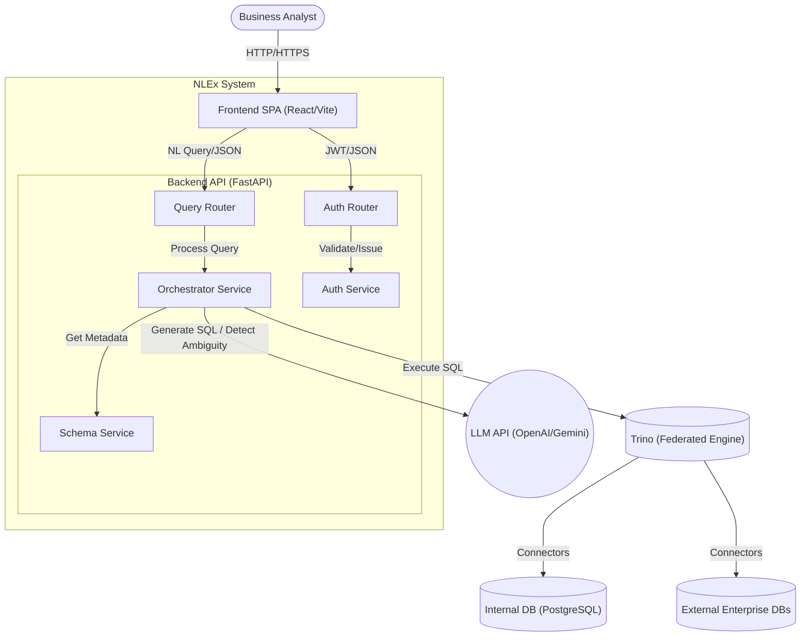

# Static View: Component Diagram

```mermaid
flowchart TD
    User([Business Analyst])
    
    subgraph NLEx["NLEx System"]
        Frontend["Frontend SPA (React/Vite)"]
        
        subgraph Backend["Backend API (FastAPI)"]
            AuthRouter["Auth Router"]
            QueryRouter["Query Router"]
            Orchestrator["Orchestrator Service"]
            SchemaService["Schema Service"]
            AuthService["Auth Service"]
        end
    end
    
    Trino[("Trino (Federated Engine)")]
    InternalDB[("Internal DB (PostgreSQL)")]
    LLM(("LLM API (OpenAI/Gemini)"))
    ExternalDBs[("External Enterprise DBs")]

    User -- HTTP/HTTPS --> Frontend
    Frontend -- JWT/JSON --> AuthRouter
    Frontend -- NL Query/JSON --> QueryRouter

    AuthRouter -- Validate/Issue --> AuthService
    QueryRouter -- Process Query --> Orchestrator
    Orchestrator -- Generate SQL / Detect Ambiguity --> LLM
    Orchestrator -- Execute SQL --> Trino
    Orchestrator -- Get Metadata --> SchemaService

    Trino -- Connectors --> InternalDB
    Trino -- Connectors --> ExternalDBs
```
