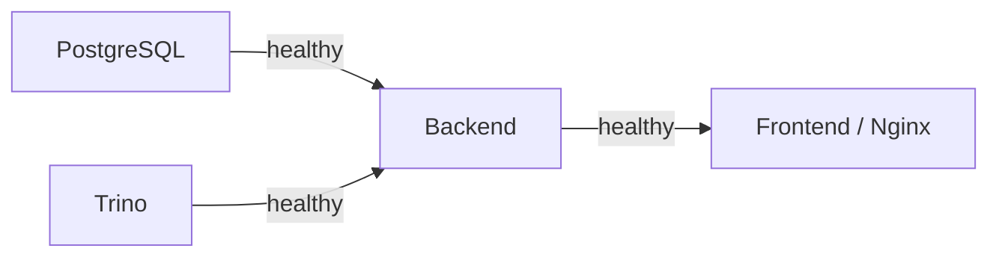

# Docker Compose Deployment

This guide covers running NLEx locally or in production using Docker Compose.

---

## Prerequisites

| Tool | Minimum Version | Check Command |
|---|---|---|
| Docker | 24.0+ | `docker --version` |
| Docker Compose | v2.20+ (plugin) | `docker compose version` |
| Git | 2.30+ | `git --version` |

!!!note "Docker Compose v2"
    NLEx uses the `docker compose` plugin syntax (not the legacy `docker-compose` binary). Make sure you have Docker Compose v2 installed as a Docker CLI plugin.

---

## Quick Start

```bash
# 1. Clone the repository
git clone https://github.com/your-org/NLEx.git
cd NLEx

# 2. Create your environment file
cp .env.example .env.secret

# 3. Edit .env.secret with your settings
#    At minimum, set:
#    - POSTGRES_PASSWORD
#    - JWT_SECRET_KEY
#    - LLM provider settings (if using AI features)
nano .env.secret

# 4. Start all services in dev mode
docker compose --profile dev up --build
```

After startup completes, the application is available at:

| Service | URL |
|---|---|
| Frontend | `http://localhost:5173` |
| Backend API | `http://localhost:8000` |
| API Docs (Swagger) | `http://localhost:8000/docs` |
| Trino UI | `http://localhost:8080` |

---

## Compose Profiles

NLEx uses Docker Compose [profiles](https://docs.docker.com/compose/profiles/) to separate environments.

### `dev` — Development with Hot Reload

```bash
docker compose --profile dev up --build
```

| Feature | Details |
|---|---|
| Frontend | Vite dev server with HMR on port `5173` |
| Backend | Uvicorn with `--reload`, source mounted as volume |
| PostgreSQL | Exposed on `5432` for local tooling |
| Trino | Exposed on `8080` |

!!!tip "Fast iteration"
    In `dev` profile, both the frontend and backend source directories are bind-mounted into the containers. Code changes are reflected immediately without rebuilding.

### `prod` — Production with Nginx

```bash
docker compose --profile prod up --build -d
```

| Feature | Details |
|---|---|
| Frontend | Static build served by Nginx on port `80` / `443` |
| Backend | Uvicorn with multiple workers, no auto-reload |
| Nginx | Reverse proxy with TLS termination (configure certs in `nginx/`) |
| PostgreSQL | Not exposed externally |
| Trino | Not exposed externally |

!!!warning "VITE_API_URL"
    The `VITE_API_URL` variable is **baked into the frontend at build time**. If you change the backend URL, you must rebuild the frontend container.

### `test` — Automated Testing

```bash
docker compose --profile test up --build --abort-on-container-exit
```

| Feature | Details |
|---|---|
| Backend | Runs `pytest` suite and exits |
| PostgreSQL | Clean database for each test run |
| Trino | Available for integration tests |

---

## Service Startup Order

Services start in dependency order using `depends_on` with health checks:



| Service | Depends On | Health Check |
|---|---|---|
| **PostgreSQL** | — | `pg_isready -U $POSTGRES_USER` |
| **Trino** | — | `curl -f http://localhost:8080/v1/info` |
| **Backend** | PostgreSQL ✅, Trino ✅ | `curl -f http://localhost:8000/health` |
| **Frontend** | Backend ✅ | HTTP `200` on `/` |

!!!note "Health check intervals"
    Default interval is `10s` with a timeout of `5s` and `5` retries. You can tune these in `docker-compose.yml` under each service's `healthcheck` block.

---

## Volumes and Persistence

| Volume | Mount Point | Purpose |
|---|---|---|
| `postgres_data` | `/var/lib/postgresql/data` | Database files — survives `docker compose down` |
| `trino_catalog` | `/etc/trino/catalog` | Trino catalog `.properties` files |
| `export_data` | `/app/exports` | Exported Excel/CSV files from chat |

!!!warning "Trino catalogs are ephemeral"
    Trino catalog `.properties` files are generated dynamically by the backend. If the Trino container is recreated without the volume, **all catalogs must be re-registered** through the NLEx UI or API.

**Removing volumes (full reset):**

```bash
docker compose down -v
```

This deletes all data including the PostgreSQL database. Use with caution.

---

## Common Commands

### View logs

```bash
# All services
docker compose --profile dev logs -f

# Specific service
docker compose --profile dev logs -f backend

# Last 100 lines
docker compose --profile dev logs --tail=100 backend
```

### Restart a single service

```bash
docker compose --profile dev restart backend
```

### Rebuild and restart

```bash
docker compose --profile dev up --build -d backend
```

### Reset the database

```bash
# Stop everything, remove volumes, restart
docker compose --profile dev down -v
docker compose --profile dev up --build
```

!!!tip "Partial reset"
    To reset only the database without rebuilding all containers:
    ```bash
    docker compose --profile dev stop postgres
    docker volume rm nlex_postgres_data
    docker compose --profile dev up -d postgres
    docker compose --profile dev restart backend
    ```

### Shell into a container

```bash
# Backend
docker compose --profile dev exec backend bash

# PostgreSQL
docker compose --profile dev exec postgres psql -U nlex -d nlex_db
```

### Run backend tests

```bash
docker compose --profile dev exec backend pytest -v
```

---

## Troubleshooting

### Backend fails to start with "Connection refused"

**Cause:** PostgreSQL or Trino is not ready yet.

**Fix:** Check the health status of dependencies:

```bash
docker compose --profile dev ps
```

Ensure `postgres` and `trino` show `healthy` status. If they're stuck in `starting`, check their logs for errors.

---

### "Port already in use" error

**Cause:** Another process is using the same port.

**Fix:** Find and stop the conflicting process:

```bash
lsof -i :5173  # or :8000, :5432, :8080
kill -9 <PID>
```

Or change the port mapping in `docker-compose.yml`.

---

### Frontend shows "Network Error"

**Cause:** `VITE_API_URL` is incorrect or the backend is not reachable.

**Fix:**

1. Verify `VITE_API_URL` in `.env.secret` matches the backend's actual address.
2. In `dev` profile, it should be `http://localhost:8000`.
3. If changed, rebuild the frontend: `docker compose --profile dev up --build frontend`.

---

### Trino catalog not appearing

**Cause:** The catalog `.properties` file was not written or Trino hasn't reloaded.

**Fix:**

1. Check the catalog was created via the API: `GET /api/v1/catalogs`
2. Verify the file exists in the Trino catalog volume:
   ```bash
   docker compose --profile dev exec trino ls /etc/trino/catalog/
   ```
3. Restart Trino if needed:
   ```bash
   docker compose --profile dev restart trino
   ```

---

### Out of disk space

**Cause:** Docker volumes or build cache are consuming disk.

**Fix:**

```bash
# Remove unused images and build cache
docker system prune -a

# Remove unused volumes (CAUTION: deletes data)
docker volume prune
```

---

### Permission errors on mounted volumes

**Cause:** File ownership mismatch between host and container.

**Fix:** Ensure the Dockerfile sets the correct user, or run:

```bash
sudo chown -R 1000:1000 ./path/to/mounted/directory
```
