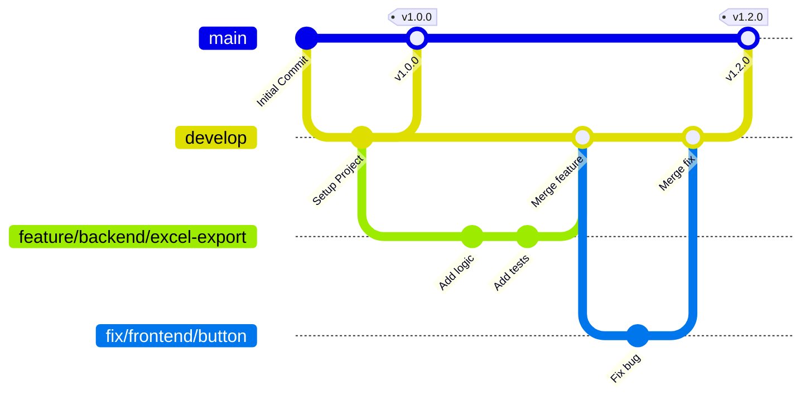

# Development Process and Configuration Management

## Git Workflow

We use a structured branch-based workflow to manage development and ensure code quality.

### Git Graph

### How the Team Uses the Workflow

1. **`main` Branch**: Represents the stable, production-ready state of the product. No direct commits are allowed. Changes are merged from `develop` via Pull Requests (PRs) when preparing for a release. SemVer tags (e.g., `v1.2.0`) are applied here.
2. **`develop` Branch**: The primary integration branch. Developers branch off from here and merge back into it via PRs. No direct commits are allowed.
3. **Feature and Fix Branches**: Named `feature/<category>/<task>` or `fix/<category>/<task>`. Developers create these for active work.
4. **Pull Requests (PRs)**: All merges into `develop` or `main` require a PR. A PR must be reviewed and approved by at least one other team member before merging.
5. **Configuration Management**: Secrets are managed locally using `.env` files (e.g., `.env.secret` derived from `.env.example`). CI/CD environments use secure repository secrets. The repository is configured to block direct pushes to protected branches.
