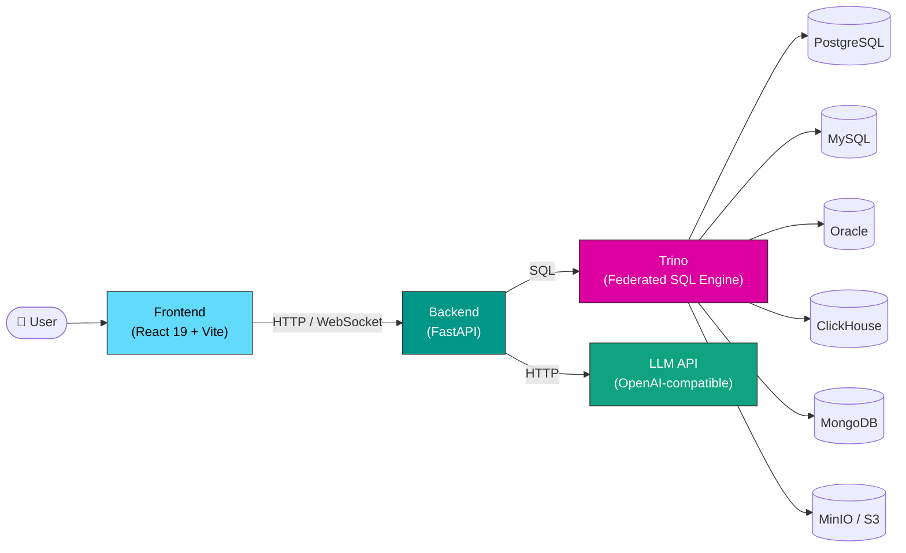

# NLEx — Natural Language to SQL Platform

**NLEx** (Natural Language Explorer) is an enterprise-grade platform that translates natural language questions into SQL queries using Large Language Models. It leverages **Trino** as a federated SQL engine to seamlessly query across multiple heterogeneous database types — all from a single conversational interface.

> [!NOTE]
> NLEx supports any OpenAI-compatible LLM provider — GPT, DeepSeek, or your own locally hosted model.

---

## Overview

NLEx bridges the gap between business users and data infrastructure. Instead of writing complex SQL queries manually, users simply ask questions in plain English (or Russian), and the platform:

1. **Understands** the question using an LLM with RAG-enhanced schema context
2. **Generates** a validated, read-only SQL query
3. **Executes** the query across any connected database via Trino
4. **Returns** structured results in real-time through WebSocket

---

## High-Level Architecture



---

## Key Features

| Feature | Description |
|---|---|
| 🗣️ **Natural Language to SQL** | Ask questions in plain language — get SQL queries and results instantly |
| 🔗 **Multi-Database Support** | Query PostgreSQL, MySQL, Oracle, ClickHouse, MongoDB, and MinIO through Trino |
| ⚡ **Real-Time Chat** | WebSocket-based conversational interface with streaming responses |
| 📊 **Excel Export** | Export query results to `.xlsx` with a single click |
| 🛡️ **Admin Panel & Analytics** | Manage users, databases, LLM configs; view usage analytics and query history |
| 🌍 **Internationalization (i18n)** | Full support for Russian and English interfaces |
| 🔐 **Role-Based Access Control** | Fine-grained permissions with admin and regular user roles |
| 🧠 **RAG Schema Filtering** | Intelligent table selection via cosine similarity to reduce token usage |
| ✅ **SQL Guard** | Read-only query enforcement at both prompt and validation levels |
| 🔌 **Dynamic Catalogs** | Add and manage database connections at runtime — no restarts required |

---

## Tech Stack

| Layer | Technology |
|---|---|
| **Frontend** | React 19, TypeScript, Vite, Ant Design, i18next |
| **Backend** | Python 3.11, FastAPI, SQLAlchemy, Pydantic |
| **Federated SQL** | Trino 481 |
| **Internal Database** | PostgreSQL 16 |
| **External Databases** | PostgreSQL, MySQL, Oracle, ClickHouse, MongoDB, MinIO |
| **LLM Integration** | OpenAI-compatible API (GPT, DeepSeek, custom) |
| **Infrastructure** | Docker, Docker Compose, nginx |
| **Auth** | JWT (access + refresh tokens) |
| **Real-Time** | WebSocket |

---

## Documentation

- 📐 [Architecture Overview](architecture/overview.md) — system design, component diagrams, request flow
- 🚀 Deployment Guide — Docker Compose setup, environment configuration *(coming soon)*
- 🛠️ Development Guide — local setup, project structure, contributing *(coming soon)*
- 📡 API Reference — REST and WebSocket endpoints *(coming soon)*

---

## Quick Start

```bash
# Clone the repository
git clone https://github.com/your-org/nlex.git
cd nlex

# Start all services
docker compose up -d

# Open the app
open http://localhost:3000
```

---

<p align="center">
  <em>Built with ❤️ using FastAPI, React, Trino, and LLMs</em>
</p>
