# Week 2 Report — NLEx

**Project:** NLEx — Natural Language to SQL
**Short Description:** A service that translates natural language requests into SQL queries, enabling business analysts to interact with databases without writing code.
**License:** [MIT](../../LICENSE)

---

## Contents

- [Week 2 Report — NLEx](#week-2-report--nlex)
  - [Contents](#contents)
  - [User Stories](#user-stories)
  - [Prototype \& Interface Artifacts](#prototype--interface-artifacts)
    - [Graphical Interface — Figma Prototype](#graphical-interface--figma-prototype)
    - [API Interface — Swagger UI, OpenAPI \& Postman Collection](#api-interface--swagger-ui-openapi--postman-collection)
  - [MVP v0 Report \& Deployment](#mvp-v0-report--deployment)
    - [Deployed Artifacts](#deployed-artifacts)
    - [Public Video Demonstration](#public-video-demonstration)
    - [Local Run Instructions](#local-run-instructions)
  - [Pull Requests \& Code Review](#pull-requests--code-review)
    - [PR Template](#pr-template)
  - [Branch Protection \& CI/CD](#branch-protection--cicd)
    - [Protected Default Branch](#protected-default-branch)
    - [Lychee Link Checker](#lychee-link-checker)
  - [Link Verification](#link-verification)
  - [Coverage](#coverage)
    - [Prototype Coverage](#prototype-coverage)
    - [MVP v0 Coverage](#mvp-v0-coverage)
  - [Customer Communication](#customer-communication)
    - [Meeting Transcript](#meeting-transcript)
    - [Customer Meeting Notes](#customer-meeting-notes)
    - [Meeting Summary](#meeting-summary)
    - [Customer Permission](#customer-permission)
  - [Weekly Analysis](#weekly-analysis)
  - [LLM Usage Report](#llm-usage-report)
  - [Report Index](#report-index)

---

## User Stories

The full set of stable user stories with MoSCoW priorities, requirement statuses, MVP version breakdown, and the initial proposed MVP v1 scope:

- [User Stories](user-stories.md)

---

## Prototype & Interface Artifacts

### Graphical Interface — Figma Prototype

The interactive Figma prototype covers the full MVP v1 user experience: authentication, database connection management, and the chat-to-SQL flow (prompt submission, clarification dialogue, draft preview, and Excel export).

🔗 **[NLEx — Figma Prototype](https://www.figma.com/design/ClCEafHql2b29oiC26gmpY/Untitled?m=auto&t=oLHybhELQCFfLaym-6)**

**Figma Screenshots:**

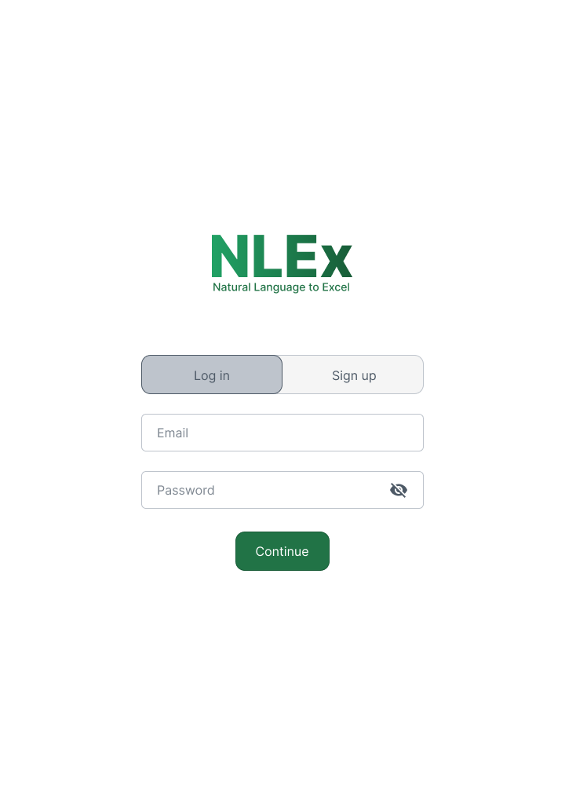
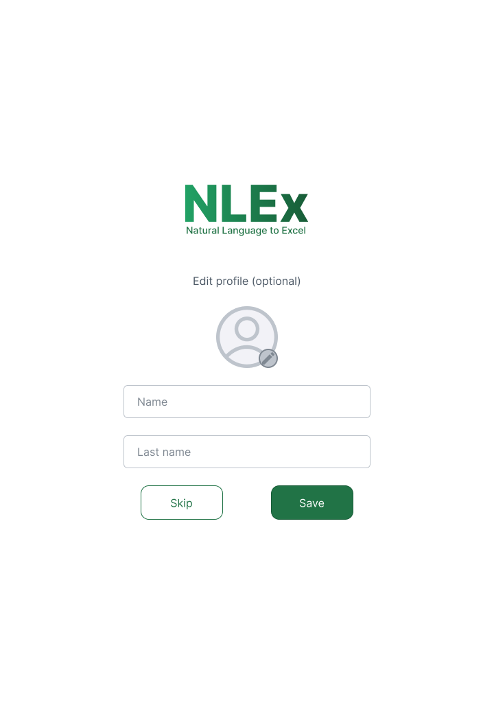
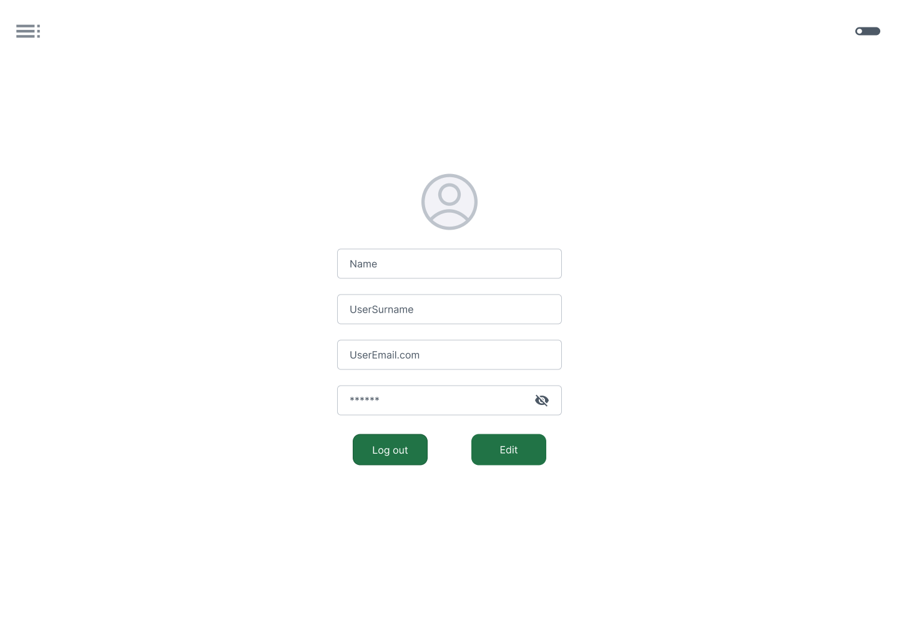
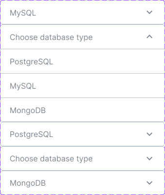
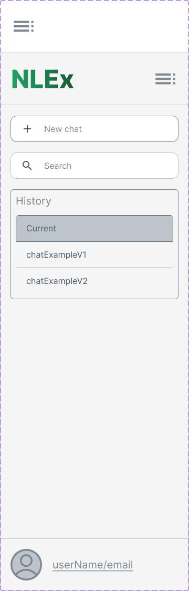
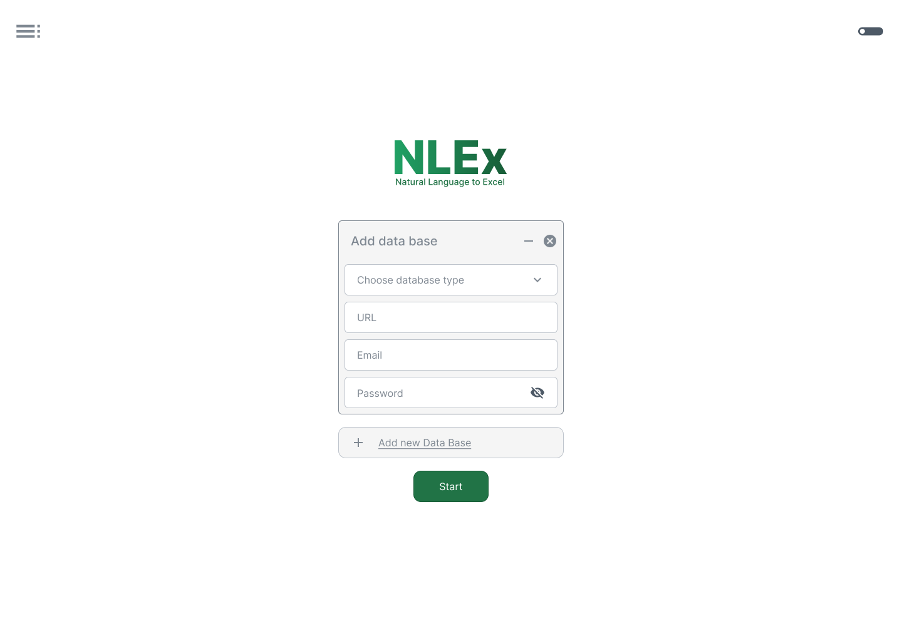
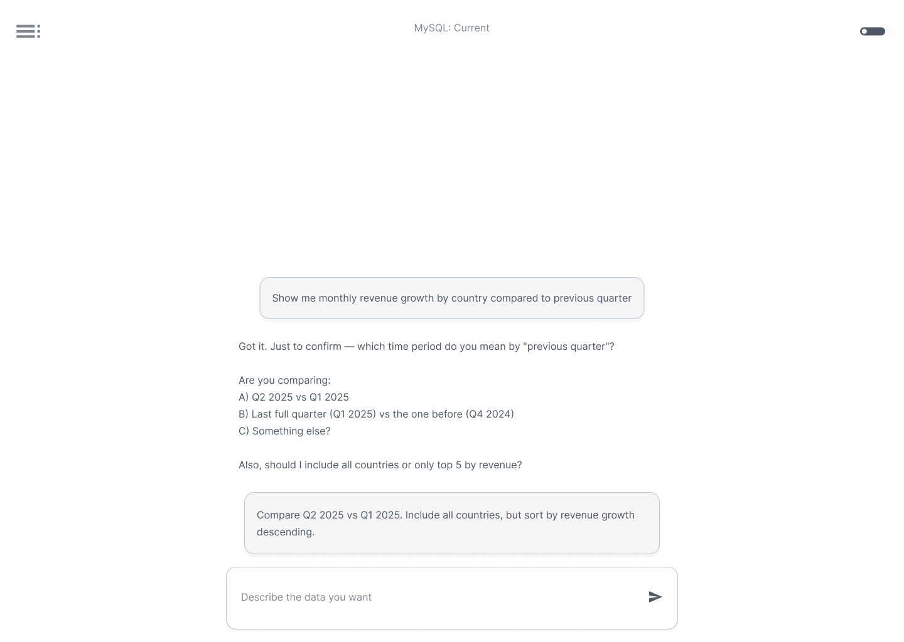
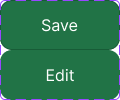
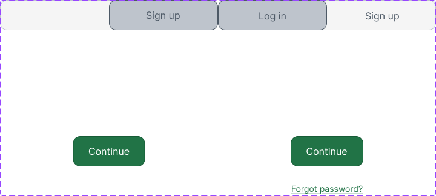

### API Interface — Swagger UI, OpenAPI & Postman Collection

The backend API is documented via Swagger UI (27 endpoints across `auth`, `users`, `chats`, and `connections` resources).

| Artifact | Link / File |
|---|---|
| **Swagger UI** | [http://194.226.97.77:8000/docs](http://194.226.97.77:8000/docs) |
| **OpenAPI Specification (YAML)** | [openapi.yaml](openapi.yaml) |
| **Postman Collection** | [postman_collection.json](postman_collection.json) |

> The backend host `194.226.97.77` is on an Innopolis VM reachable from RU networks. International reviewers may need a VPN with a RU exit.

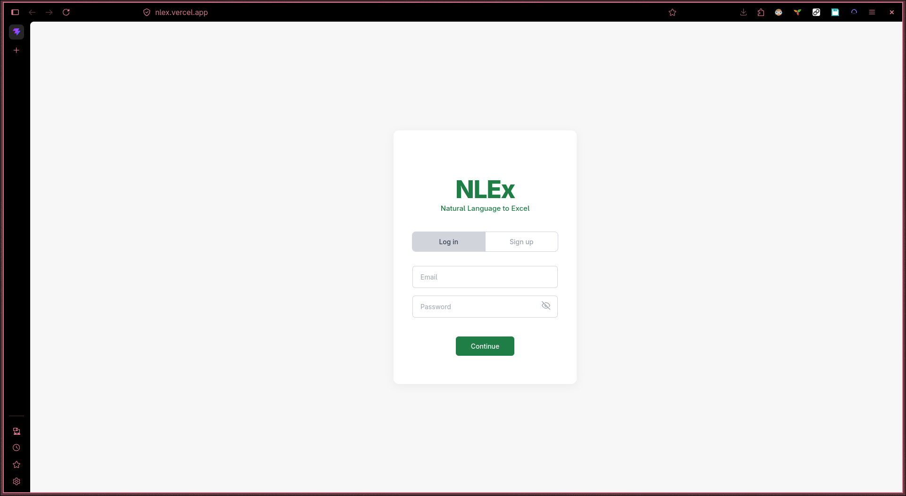

---

## MVP v0 Report & Deployment

The MVP v0 technical foundation is deployed and smoke-testable. It demonstrates end-to-end connectivity between the React frontend and FastAPI backend, with all 27 API endpoints documented and mock-ready.

- [MVP v0 Report](mvp-v0-report.md)

### Deployed Artifacts

| Resource | URL |
|---|---|
| **Frontend** | [https://nlex.vercel.app/](https://nlex.vercel.app/) |
| **Backend API (Swagger)** | [http://194.226.97.77:8000/docs](http://194.226.97.77:8000/docs) |
| **Backend API (Base)** | [http://194.226.97.77:8000](http://194.226.97.77:8000) |

### Public Video Demonstration

🔗 **[MVP v0 Demo Video](https://drive.google.com/file/d/1tTa6MDl0N_5i25dURntALOUFs9w6NxTL/view?usp=sharing)**


### Local Run Instructions

Full Docker-based setup instructions are available in the root [README.md](../../README.md). Quick start:

```bash
cp .env.example .env.secret
docker compose --env-file .env.secret --profile dev up --build
```

- Frontend: `http://localhost:5173`
- Backend API: `http://localhost:8000`
- Swagger Docs: `http://localhost:8000/docs`

---

## Pull Requests & Code Review

All Week 2 pull requests were peer-reviewed by another team member. The following PRs were created and reviewed:

| PR | Link |
|---|---|
| #6 | [https://github.com/NLEx-team/NLEx/pull/6](https://github.com/NLEx-team/NLEx/pull/6) |
| #7 | [https://github.com/NLEx-team/NLEx/pull/7](https://github.com/NLEx-team/NLEx/pull/7) |
| #8 | [https://github.com/NLEx-team/NLEx/pull/8](https://github.com/NLEx-team/NLEx/pull/8) |
| #9 | [https://github.com/NLEx-team/NLEx/pull/9](https://github.com/NLEx-team/NLEx/pull/9) |
| #10 | [https://github.com/NLEx-team/NLEx/pull/10](https://github.com/NLEx-team/NLEx/pull/10) |
| #11 | [https://github.com/NLEx-team/NLEx/pull/11](https://github.com/NLEx-team/NLEx/pull/11) |
| #15 | [https://github.com/NLEx-team/NLEx/pull/15](https://github.com/NLEx-team/NLEx/pull/15) |
| #16 | [https://github.com/NLEx-team/NLEx/pull/16](https://github.com/NLEx-team/NLEx/pull/16) |

### PR Template

The project uses a standard pull request template. The canonical version lives at [`.github/pull_request_template.md`](../../.github/pull_request_template.md) and is mirrored for Week 2 review at [`PR_template.md`](PR_template.md).

**Reviewed PR Examples:**

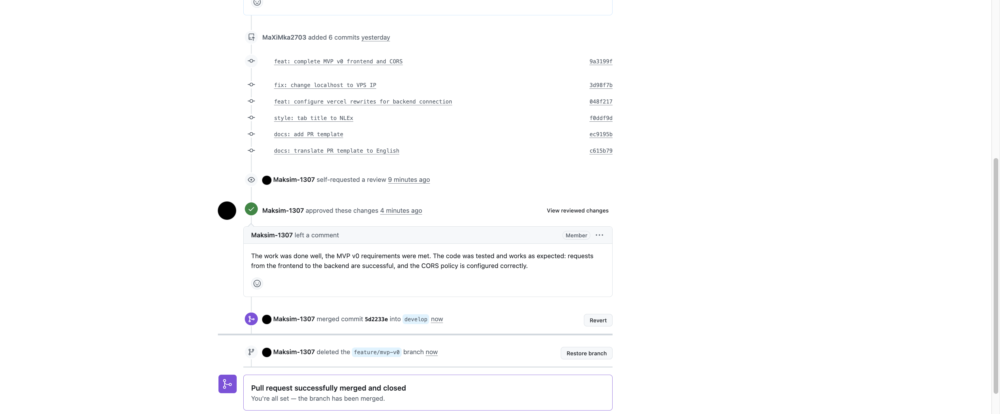
.png)

---

## Branch Protection & CI/CD

### Protected Default Branch

The `develop` branch is the protected default branch. The latest successful state:

🔗 **[develop branch](https://github.com/NLEx-team/NLEx/tree/develop)**

**Branch Protection Settings:**

.png)
.png)
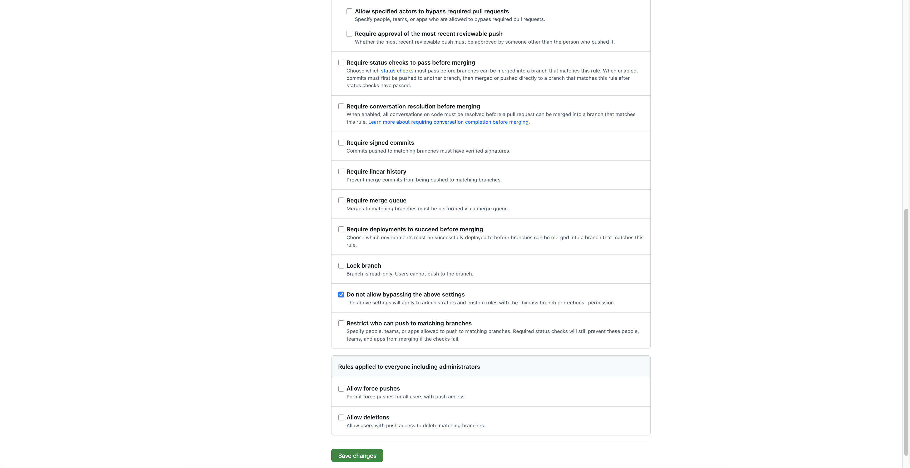

### Lychee Link Checker

Lychee link checking is configured via:

- Workflow: [`.github/workflows/lychee.yml`](../../.github/workflows/lychee.yml)
- Config: [`lychee.toml`](../../lychee.toml)

The workflow runs on every push and pull request against the protected `develop` and `main` branches, and once a week on schedule. The latest successful run on the protected default branch is available on the [Actions tab](https://github.com/NLEx-team/NLEx/actions/workflows/lychee.yml?query=branch%3Adevelop).

**Excluded links (with justification):**

| Pattern | Reason | Manually verified |
|---|---|---|
| `^http://194\.226\.97\.77` | Backend on an Innopolis VM, reachable only from RU networks. GitHub-hosted runners cannot reach it. | ✅ |
| `^http://localhost`, `^http://127\.0\.0\.1` | Local development URLs only meaningful on the developer's machine. | ✅ |
| `^https://www\.figma\.com` | Figma blocks HEAD probes and rate-limits anonymous CI clients. | ✅ |
| `^https://drive\.google\.com` | Google Drive requires session cookies to confirm reachability of `view` URLs. | ✅ |

All excluded links were opened in a browser before submission to confirm they are accessible.

---

## Link Verification

All links in this report and accompanying documents were manually verified:

| Link | Type | Verified |
|---|---|---|
| Figma Prototype | External | ✅ |
| Swagger UI (`194.226.97.77:8000/docs`) | External (RU-only) | ✅ |
| Frontend (`nlex.vercel.app`) | External | ✅ |
| Demo Video (Google Drive) | External | ✅ |
| GitHub PRs (#6–#11, #15, #16) | External | ✅ |
| `develop` branch | External | ✅ |
| All internal `.md` file links | Relative | ✅ |
| `openapi.yaml` | Relative | ✅ |
| `postman_collection.json` | Relative | ✅ |
| `../../LICENSE` | Relative | ✅ |
| `../../README.md` | Relative | ✅ |
| `../../.github/workflows/lychee.yml` | Relative | ✅ |
| `../../lychee.toml` | Relative | ✅ |

Lychee-excluded links are listed in the previous section with justification.

---

## Coverage

### Prototype Coverage

The Figma prototype visually addresses the following stable user-story IDs (see [`user-stories.md`](user-stories.md) for full text):

| Story | Description | Covered in Prototype |
|---|---|---|
| US-01 | Natural language query input | ✅ Chat input field and prompt flow |
| US-02 | Single database selector | ✅ Database dropdown in chat setup |
| US-03 | Excel file download | ✅ Save & download button in Reply Preview |
| US-04 | Result preview in browser | ✅ Reply Preview with first rows |
| US-05 | Clarification dialogue | ✅ Clarifying question flow |
| US-06 | Config-file DB connection | Not in prototype (backend / Data Engineer concern) |
| US-07 | Startup health-check | ✅ "Test Connection" button in Add Database screen |
| US-08 | View generated SQL | ✅ SQL preview area (collapsible) |
| US-09 | Query history | Not in current prototype (Should Have, deferred) |
| US-10 | Excel auto-formatting | Implied by Excel export flow |

### MVP v0 Coverage

MVP v0 provides the technical foundation for the following stable user-story IDs by establishing the deployment infrastructure, API surface, and connectivity between frontend and backend:

| Story | Description | MVP v0 Contribution |
|---|---|---|
| US-01 | Natural language query input | Backend endpoint `POST /chats/{chat_id}/prompt` defined; frontend auth page live |
| US-02 | Single database selector | Endpoints for `connections` resource defined and documented in Swagger |
| US-04 | Result preview in browser | Response schema models the preview payload |
| US-05 | Clarification dialogue | Response schema models the clarification turn |
| US-06 | Config-file DB connection | Docker-based deployment with `.env`-driven configuration is operational |
| US-07 | Startup health-check | `GET /` health endpoint is reachable through Swagger |
| US-08 | View generated SQL | Response schema includes the generated SQL field |

For full details on MVP v0 capabilities and the repeatable smoke-check scenario, see [`mvp-v0-report.md`](mvp-v0-report.md).

---

## Customer Communication

### Meeting Transcript

The full transcript of the Week 2 customer meeting (Russian original and English translation, with speaker attributions and timecodes):

- [Customer Meeting Transcript](customer-meeting-transcript.md)

### Customer Meeting Notes

Supplementary action items captured live during the meeting (the transcript is the primary evidence):

- [Customer Meeting Notes](customer-meeting-notes.md)

### Meeting Summary

A structured summary of the meeting with key decisions, action items, and notes:

- [Customer Meeting Summary](customer-meeting-summary.md)

### Customer Permission

The meeting was recorded with the customer's permission. The customer agreed to:
- Recording and private sharing of the sanitized transcript with course instructors for assessment.
- Publication of the sanitized English transcript in the public repository.

**Evidence of written consent to the MIT-licensed public development model:**

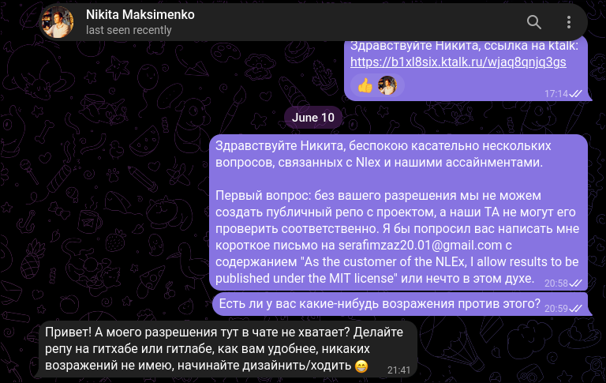

---

## Weekly Analysis

The Sprint 1 / Week 2 analysis covering learning points, validated assumptions, items needing clarification, and planned responses:

- [Weekly Analysis](analysis.md)

---

## LLM Usage Report

A detailed report on how AI/LLM tools were used throughout Week 2 for transcription, translation, proofreading, and formatting:

- [LLM Usage Report](llm-report.md)

---

## Report Index

| Document | File |
|---|---|
| **This Index** | `reports/week2/README.md` |
| User Stories | [user-stories.md](user-stories.md) |
| MVP v0 Report | [mvp-v0-report.md](mvp-v0-report.md) |
| LLM Usage Report | [llm-report.md](llm-report.md) |
| Customer Transcript | [customer-meeting-transcript.md](customer-meeting-transcript.md) |
| Customer Meeting Notes | [customer-meeting-notes.md](customer-meeting-notes.md) |
| Customer Meeting Summary | [customer-meeting-summary.md](customer-meeting-summary.md) |
| Weekly Analysis | [analysis.md](analysis.md) |
| PR Template (mirror) | [PR_template.md](PR_template.md) |
| PR Template (canonical) | [../../.github/pull_request_template.md](../../.github/pull_request_template.md) |
| OpenAPI Specification | [openapi.yaml](openapi.yaml) |
| Postman Collection | [postman_collection.json](postman_collection.json) |
| Lychee Workflow | [../../.github/workflows/lychee.yml](../../.github/workflows/lychee.yml) |
| Lychee Config | [../../lychee.toml](../../lychee.toml) |
| Local Setup (Root) | [../../README.md](../../README.md) |
| Root LICENSE | [../../LICENSE](../../LICENSE) |

---

**Screenshots** are located in `reports/week2/images/`:

| Screenshot | File |
|---|---|
| Login | `images/figma_artifacts/login.png` |
| Create Profile | `images/figma_artifacts/createProfile.png` |
| Edit Profile | `images/figma_artifacts/editProfile.png` |
| Input CDB | `images/figma_artifacts/inputCDB.png` |
| Sidebar | `images/figma_artifacts/Sidebar.png` |
| Create New Session | `images/figma_artifacts/createNewSession.png` |
| Chat Example V1 | `images/figma_artifacts/chatExampleV1.png` |
| Buttons | `images/figma_artifacts/buttons.png` |
| Toggle | `images/figma_artifacts/toggle.png` |
| Branch Protection — 1 | `images/master-branch-rule/image_2026-06-14_19-30-26(1).png` |
| Branch Protection — 2 | `images/master-branch-rule/image_2026-06-14_19-30-26(2).png` |
| Branch Protection — 3 | `images/master-branch-rule/image_2026-06-14_19-30-26.png` |
| Reviewed PR — 1 | `images/PR-example/image_2026-06-14_20-06-30.png` |
| Reviewed PR — 2 | `images/PR-example/image_2026-06-14_20-06-30(1).png` |
| MIT Permission | `images/MIT-permission.png` |
| Runnable Artifact (Swagger) | `images/runnable-artifact.png` |
