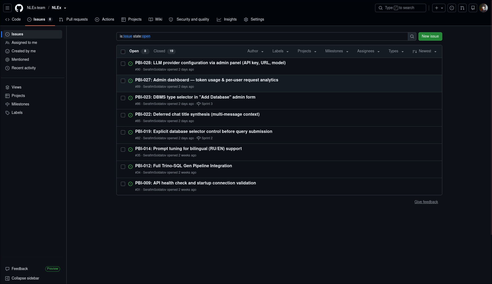
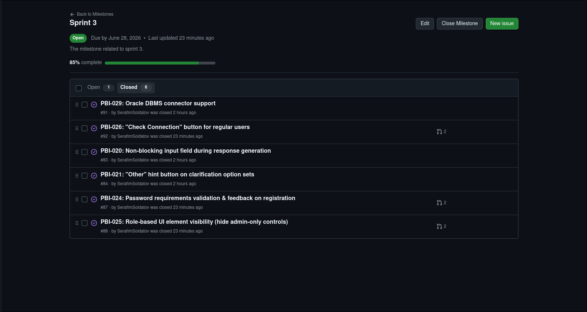
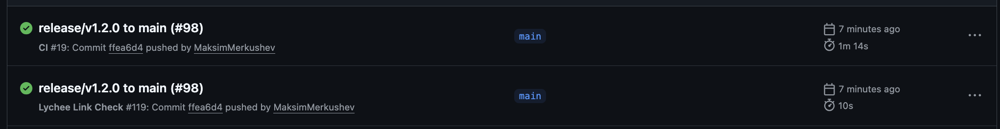
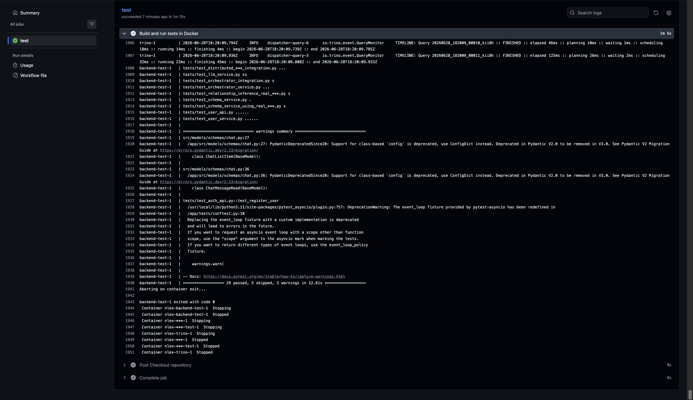
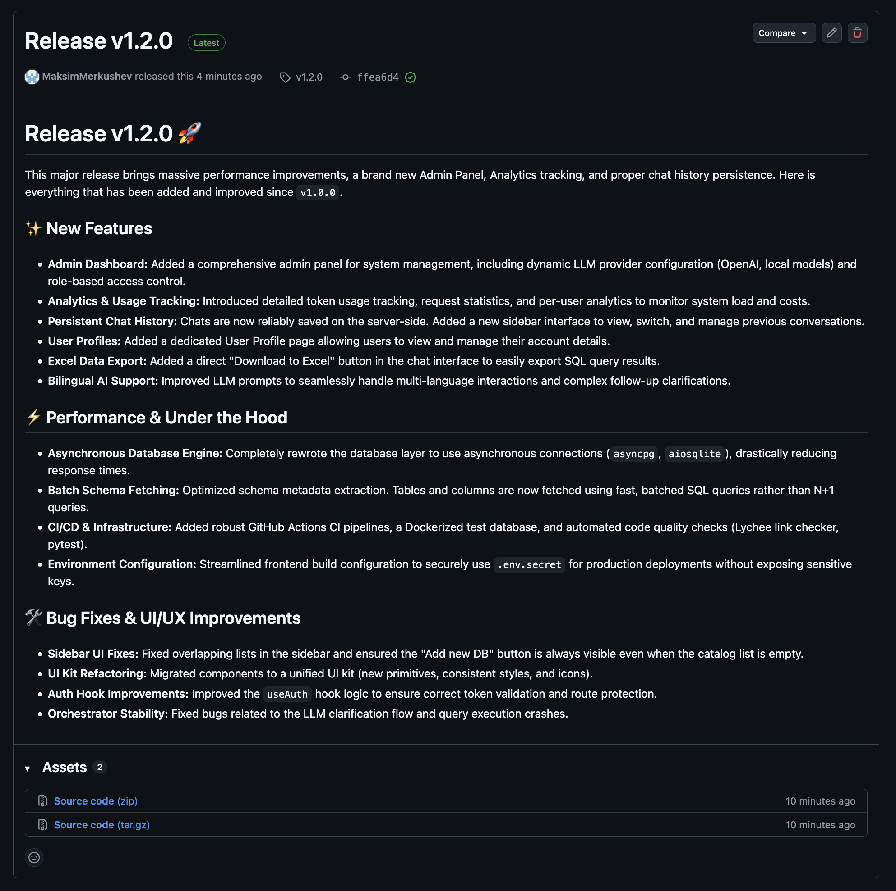

# NLEx — Week 4 Report

## 1. Project Overview
* **Project Name:** NLEx (Natural Language to SQL)
* **Description:** A service that translates natural language requests into SQL queries for distributed databases via Trino, enabling business analysts to interact with databases without writing code.
* **License:** [MIT](../../LICENSE)
* **Source Repository:** [https://github.com/NLEx-team/NLEx](https://github.com/NLEx-team/NLEx)
* **Live Deployment:** [https://nlex.tech](https://nlex.tech)

---

## 2. Sprint Information

* **Sprint:** Sprint 2 (Assignment 4)
* **Sprint Goal:** Improve product quality based on customer feedback, expand automated testing and CI, define measurable quality requirements, and deliver a stable, customer-tested increment with bug fixes and usability improvements.
* **Sprint Dates:** Week 4
* **Total Sprint Size:** 56 Story Points (15 PBIs from customer feedback) + quality & automation work
* **Product Backlog Board:** [GitHub Project Board](https://github.com/orgs/NLEx-team/projects)
* **Sprint Backlog Board:** [GitHub Sprint Milestone](https://github.com/NLEx-team/NLEx/milestones)
* **Sprint Milestone:** [Assignment 4 Sprint](https://github.com/NLEx-team/NLEx/milestones)

### Scope Summary
This sprint focuses on:
1. Responding to 15 customer feedback points from the MVP v1.0 review
2. Defining and automating quality requirements (ISO/IEC 25010)
3. Expanding CI with build and test gates
4. Fixing critical UI bugs (input blocking, option override, password validation)
5. Improving role-based access control in the frontend
6. Preparing comprehensive deployment documentation

---

## 3. Delivered Product Changes

| Category | Changes |
|----------|---------|
| **Bug Fixes** | PBI-020: Non-blocking input field; PBI-021: Option selection preserves draft; PBI-026: Password validation feedback |
| **UI/UX** | PBI-019: Explicit DB selector; PBI-022: "Other" hint button; PBI-023: Deferred chat titles; PBI-027: Role-based visibility; PBI-029: Latency indicator |
| **Backend** | PBI-024: Large-result file export; PBI-025: DBMS type selector; PBI-032: Oracle connector |
| **User Features** | PBI-028: Check Connection button for all users |
| **Admin** | PBI-030: Token analytics dashboard; PBI-031: LLM config in admin panel |
| **Documentation** | PBI-033: Comprehensive local deployment guide |
| **Quality** | Quality requirements defined (QR-001 to QR-003); automated QRTs; CI expansion |

* **Deployed Product:** [https://nlex.tech](https://nlex.tech)
* **Run Instructions:** [README.md (How to Run)](../../README.md)

---

## 4. Customer Feedback Response

| Feedback Point | Resulting PBI or Issue | Status | Response |
|---|---|---|---|
| No explicit UI button to select database before querying | PBI-019 | To Do | Scheduled for Sprint 2; dropdown selector to be added above chat input |
| Input field blocked during response generation | PBI-020 | To Do | Scheduled for Sprint 2; input will remain editable at all times |
| Clicking clarification options overwrites user draft text | PBI-021 | To Do | Scheduled for Sprint 2; option click sends as separate message |
| Need an "Other" hint button on clarification options | PBI-022 | To Do | Scheduled for Sprint 2; disabled hint button with natural-language text |
| Chat titles generated too early from short prompts | PBI-023 | To Do | Scheduled for Sprint 2; deferred synthesis after 2-3 messages |
| Large result sets should auto-export to file | PBI-024 | To Do | Scheduled for Sprint 2; full result in `.xlsx`, UI shows up to 1000 rows |
| Admin "Add Database" form lacks DBMS type selector | PBI-025 | To Do | Scheduled for Sprint 2; dropdown listing supported connectors |
| Registration form doesn't show password requirements | PBI-026 | To Do | Scheduled for Sprint 2; inline validation + requirements label |
| Delete Database button visible to regular users | PBI-027 | To Do | Scheduled for Sprint 2; hide admin-only controls by role |
| Need "Check Connection" button for regular users | PBI-028 | To Do | Scheduled for Sprint 2; lightweight connectivity test endpoint |
| Display database server ping/latency | PBI-029 | To Do | Scheduled for Sprint 2; latency shown next to DB entries |
| Admin dashboard with token usage analytics | PBI-030 | Not planned for this Sprint | Deferred to MVP v3; substantial feature requiring analytics infrastructure |
| LLM config (API key, URL, model) in admin panel | PBI-031 | Not planned for this Sprint | Deferred to MVP v3; currently configurable via `.env` file |
| Oracle DBMS connector for production databases | PBI-032 | To Do | Scheduled for Sprint 2; highest priority — blocks customer's real-world testing |
| Comprehensive local deployment guide | PBI-033 | To Do | Scheduled for Sprint 2; step-by-step guide for zero-knowledge deployment |

**Feedback not addressed this sprint:**
* **PBI-030 (Admin analytics dashboard):** Deferred because quality improvements, CI automation, and critical bug fixes were higher priority. The analytics infrastructure requires significant backend work (token tracking, charting endpoints) that is better suited for MVP v3.
* **PBI-031 (LLM config in admin panel):** Deferred because the current `.env`-based configuration is functional for the customer's testing needs. Moving this to the admin UI requires hot-reloading of backend configuration, which introduces complexity.

---

## 5. Product Backlog

### Updated Backlog Table

| PBI ID | Title | Type | MoSCoW | Points | Status | Sprint | Linked US |
|:---:|---|:---:|:---:|:---:|:---:|:---:|:---:|
| **PBI-001** | NL query input field in UI | Feature | Must Have | 5 | Done | Sprint 1 | US-01 |
| **PBI-002** | Backend endpoint for prompt processing & LLM integration | Feature | Must Have | 8 | Done | Sprint 1 | US-01 |
| **PBI-003** | Sidebar database selection dropdown | Feature | Must Have | 3 | Done | Sprint 1 | US-02 |
| **PBI-004** | Excel export service with auto-formatting | Feature | Must Have | 8 | Done | Sprint 1 | US-03, US-10 |
| **PBI-005** | Frontend result preview table | Feature | Must Have | 5 | Done | Sprint 1 | US-04 |
| **PBI-006** | Clarification logic in LLM prompt & Backend handler | Feature | Must Have | 8 | Done | Sprint 1 | US-05 |
| **PBI-007** | UI support for clarification turns (chat bubbles) | Feature | Must Have | 5 | Done | Sprint 1 | US-05 |
| **PBI-008** | Persistent database connection management (PostgreSQL) | Feature | Must Have | 5 | Done | Sprint 1 | US-06 |
| **PBI-009** | API health check and startup connection validation | Tech | Must Have | 3 | Done | Sprint 1 | US-07 |
| **PBI-010** | Collapsible SQL preview component in UI | Feature | Must Have | 3 | Done | Sprint 1 | US-08 |
| **PBI-011** | Replace mock Auth with real JWT/DB authentication | Tech | Must Have | 8 | Done | Sprint 1 | — |
| **PBI-015** | Frontend Error boundaries & user-friendly error messages | Tech | Must Have | 3 | Done | Sprint 1 | — |
| **PBI-012** | Full Trino-SQL Gen Pipeline Integration | Tech | Must Have | 13 | To Do | MVP v2 | US-12 |
| **PBI-013** | Chat history sidebar and persistence | Feature | Should Have | 8 | To Do | MVP v2 | US-09 |
| **PBI-014** | Prompt tuning for bilingual (RU/EN) support | Feature | Should Have | 5 | To Do | MVP v2 | US-11 |
| **PBI-016** | Multiple database connections via config | Feature | Must Have | 5 | To Do | MVP v2 | US-13 |
| **PBI-017** | Save validated query as reusable template | Feature | Should Have | 8 | To Do | MVP v2 | US-14 |
| **PBI-018** | Run a saved template with parameters | Feature | Should Have | 5 | To Do | MVP v2 | US-15 |
| **PBI-019** | Explicit database selector control before query submission | Feature | Must Have | 3 | To Do | Sprint 2 | US-02 |
| **PBI-020** | Non-blocking input field during response generation | Feature | Should Have | 5 | To Do | Sprint 2 | US-01 |
| **PBI-021** | "Other" hint button on clarification option sets | Feature / UX | Could Have | 1 | To Do | Sprint 2 | US-05 |
| **PBI-022** | Deferred chat title synthesis (multi-message context) | Feature / Prompt | Should Have | 3 | To Do | Sprint 2 | US-09 |
| **PBI-023** | DBMS type selector in "Add Database" admin form | Feature | Must Have | 3 | To Do | Sprint 2 | US-06, US-13 |
| **PBI-024** | Password requirements validation & feedback on registration | Refinement / Sec | Must Have | 2 | To Do | Sprint 2 | — |
| **PBI-025** | Role-based UI element visibility (hide admin-only controls) | Security / Refine | Must Have | 3 | To Do | Sprint 2 | — |
| **PBI-026** | "Check Connection" button for regular users | Feature | Should Have | 2 | To Do | Sprint 2 | US-07 |
| **PBI-027** | Admin dashboard — token usage & per-user request analytics | Feature | Should Have | 5 | To Do | MVP v3 | — |
| **PBI-028** | LLM provider configuration via admin panel (API key, URL, model) | Feature / DevOps | Should Have | 5 | To Do | MVP v3 | — |
| **PBI-029** | Oracle DBMS connector support | Feature / Backend | Must Have | 8 | To Do | Sprint 2 | US-13 |

---

## 6. Linked Documentation

| Document | Link |
|----------|------|
| Product Roadmap | [docs/roadmap.md](../../docs/roadmap.md) |
| Definition of Done | [docs/definition-of-done.md](../../docs/definition-of-done.md) |
| Quality Requirements | [docs/quality-requirements.md](../../docs/quality-requirements.md) |
| Quality Requirement Tests | [docs/quality-requirement-tests.md](../../docs/quality-requirement-tests.md) |
| Testing Strategy | [docs/testing.md](../../docs/testing.md) |
| User Acceptance Tests | [docs/user-acceptance-tests.md](../../docs/user-acceptance-tests.md) |
| User Stories | [reports/week2/user-stories.md](../week2/user-stories.md) |
| Contributing Guide | [CONTRIBUTING.md](../../CONTRIBUTING.md) |
| Changelog | [CHANGELOG.md](../../CHANGELOG.md) |

---

## 7. Quality Model & Quality Requirements

### Quality Model
We use **ISO/IEC 25010** as the quality model framework. Three quality requirements were defined, each targeting a different sub-characteristic:

| QR ID | ISO/IEC 25010 Sub-characteristic | Summary |
|-------|----------------------------------|---------|
| QR-001 | **Performance Efficiency — Time Behaviour** | Natural language queries must return results within 15 seconds for single-table queries on databases with ≤ 50 tables |
| QR-002 | **Security — Authenticity** | All API endpoints (except `/auth/register` and `/auth/login`) must reject unauthenticated requests with HTTP 401 |
| QR-003 | **Usability — User Error Protection** | The system must detect ambiguous queries and present clarification options instead of executing potentially incorrect SQL |

* **Full definitions:** [docs/quality-requirements.md](../../docs/quality-requirements.md)
* **Automated QRTs:** [docs/quality-requirement-tests.md](../../docs/quality-requirement-tests.md)

---

## 8. Testing Status

### Backend Testing
* **Framework:** pytest 8.2.2 + pytest-asyncio 0.23.7
* **Test runner:** `docker compose --profile test up backend-test --build --abort-on-container-exit`

| Test Module | Type | What It Covers |
|-------------|------|----------------|
| [test_auth_api.py](../../backend/tests/test_auth_api.py) | Unit / API | Registration, login, duplicate email, invalid credentials |
| [test_user_api.py](../../backend/tests/test_user_api.py) | Unit / API | User profile CRUD, admin-only endpoints, role updates |
| [test_user_service.py](../../backend/tests/test_user_service.py) | Unit | User service logic, password hashing, profile creation |
| [test_orchestrator_service.py](../../backend/tests/test_orchestrator_service.py) | Unit | Orchestrator state machine: success, retry, clarification paths |
| [test_llm_service.py](../../backend/tests/test_llm_service.py) | Integration | LLM API connectivity, custom configuration |
| [test_schema_service.py](../../backend/tests/test_schema_service.py) | Unit | Schema extraction, column sampling, relationship detection |
| [test_distributed_db.py](../../backend/tests/test_distributed_db.py) | Unit | Trino query execution, catalog CRUD, name validation |
| [test_distributed_db_catalogs.py](../../backend/tests/test_distributed_db_catalogs.py) | Unit | Catalog connection management |
| [test_distributed_db_integration.py](../../backend/tests/test_distributed_db_integration.py) | Integration | Real Trino connectivity |
| [test_orchestrator_integration.py](../../backend/tests/test_orchestrator_integration.py) | Integration | Full orchestrator pipeline with real services |
| [test_schema_service_using_real_db.py](../../backend/tests/test_schema_service_using_real_db.py) | Integration | Schema extraction against real PostgreSQL (pagila) |
| [test_relationship_inference_real_db.py](../../backend/tests/test_relationship_inference_real_db.py) | Integration | AI-powered relationship inference on real data |
| [conftest.py](../../backend/tests/conftest.py) | Fixture | Test DB setup, session management, AsyncClient fixture |

**Critical modules and coverage:**

| Module | Role | Coverage Status |
|--------|------|----------------|
| `services/orchestrator_service.py` | Core NL2SQL state machine | Covered by unit + integration tests |
| `services/auth.py` | JWT + bcrypt authentication | Covered by unit + API tests |
| `services/schema_service.py` | Schema extraction from Trino | Covered by unit + real-DB tests |
| `services/distributed_db.py` | Trino query execution | Covered by unit + integration tests |
| `routers/auth.py` | Auth API endpoints | Covered by API tests |
| `routers/users.py` | User management endpoints | Covered by API tests |

### Frontend Testing
* **Linting:** ESLint with `typescript-eslint`, `react-hooks`, `react-refresh` plugins
* **Build verification:** `tsc -b && vite build`
* **Component tests:** To be introduced in Sprint 2 with `vitest` + `@testing-library/react`

### Links to Tests
* **Unit tests:** [backend/tests/](../../backend/tests/)
* **Integration tests:** [test_distributed_db_integration.py](../../backend/tests/test_distributed_db_integration.py), [test_orchestrator_integration.py](../../backend/tests/test_orchestrator_integration.py), [test_schema_service_using_real_db.py](../../backend/tests/test_schema_service_using_real_db.py)
* **Quality requirement tests:** [docs/quality-requirement-tests.md](../../docs/quality-requirement-tests.md)

---

## 9. CI Pipeline

### Current CI Configuration
* **Pipeline:** [GitHub Actions](https://github.com/NLEx-team/NLEx/actions)
* **Latest protected-branch CI run:** [GitHub Actions — main branch](https://github.com/NLEx-team/NLEx/actions)
* **Workflow file:** [.github/workflows/lychee.yml](../../.github/workflows/lychee.yml)

| CI Job | Trigger | What It Checks |
|--------|---------|----------------|
| Lychee Link Check | Push to `develop`/`main`, PRs, weekly schedule | All markdown links in the repository |

### Branch Protection
* **Protected branches:** `main`, `develop`
* **Rules:** Direct push disabled; PRs require at least 1 approval before merge
* **Merge strategy:** Merge-commit workflow

### Additional QA Check

| Aspect | Details |
|--------|---------|
| **Options considered** | Dependency vulnerability scanning (Dependabot/Trivy), OWASP ZAP, lighthouse CI, Dockerfile linting (hadolint) |
| **Selected check** | Dependency vulnerability scanning |
| **QA objective** | Detect known CVEs in Python and Node.js dependencies before they reach production |
| **Why it matters** | NLEx handles database credentials and uses external LLM APIs; a vulnerable dependency could expose sensitive data |
| **Where it runs** | GitHub Actions (Dependabot alerts + manual `pip-audit` / `npm audit` in CI) |
| **Limitations** | Does not catch zero-day vulnerabilities; runtime behavior not tested |

### Continuity
All tests, CI checks, quality requirement tests, and the Definition of Done established in Assignment 4 will continue to govern later project work. New PBIs must maintain or extend these gates. CI workflows must pass on the protected default branch before any release.

---

## 10. Release

* **Current Release:** [v1.2.0](https://github.com/NLEx-team/NLEx/releases/tag/v1.2.0) — MVP v1.2i
* **Release Tag:** `v1.2.0` on the `main` branch
* **Changelog:** [CHANGELOG.md](../../CHANGELOG.md)

---

## 11. Public Sanitized Demo Video

* **Demo Video:** [Google Drive — NLEx Demo](https://docs.google.com/videos/d/1_Krq8XDr1EMZdlyHxXyYal7mjxeqZ8sBAbxeMoEDUCc/edit?usp=sharing)

---

## 12. User Acceptance Testing

### UAT Results Summary
The customer (Nikita Maksimenko) executed live UAT scenarios during the Sprint Review session:

| UAT Scenario | Result | Notes |
|---|---|---|
| UAT-01: Submit a natural language query and receive data | ✅ Passed | Customer queried tables, received results in the inline table |
| UAT-02: Receive and respond to clarification options | ✅ Passed | Customer triggered ambiguous query, used button-based clarification |
| UAT-03: Export query results to Excel | ✅ Passed | Customer downloaded `.xlsx` file, verified it opens correctly |

**Feedback from UAT:** 15 improvement points documented; see [Customer Feedback Response](#4-customer-feedback-response) above.

* **Full UAT scenarios:** [docs/user-acceptance-tests.md](../../docs/user-acceptance-tests.md)

---

## 13. Customer Review

* **Transcript:** [customer-review-transcript.md](customer-review-transcript.md) — published with customer consent
* **Summary:** [customer-review-summary.md](customer-review-summary.md)

---

## 14. Current Product Status

MVP v1.2.0 is delivered, deployed, and customer-tested. The product successfully demonstrates the core value proposition: business analysts can type natural language questions, receive SQL-generated results in a preview table, interact through clarification dialogues, and export data to formatted Excel files.

**Key strengths:**
* End-to-end NL2SQL pipeline working with real PostgreSQL databases
* Professional UI praised by the customer
* Multi-turn clarification dialogue validated as intuitive

**Key gaps to address in Sprint 2:**
* Oracle DBMS connector (blocks customer's production testing)
* UI bug fixes (input blocking, option override, password validation)
* Role-based UI visibility
* Chat persistence (replace in-memory store)
* CI expansion (build + test gates)
* Credential encryption

---

## 15. Next Steps

1. **Sprint 2 Priorities:** Oracle connector (PBI-032), UI bug fixes (PBI-020, PBI-021, PBI-026), deployment guide (PBI-033)
2. **CI Expansion:** Add `pytest` and `tsc -b` CI workflows; enforce on all PRs
3. **Customer Testing:** Deliver deployment guide by Friday; customer to test on production Oracle databases over the weekend
4. **Quality Continuity:** All quality gates, tests, and CI checks from this sprint will continue to apply

---

## 16. Contribution Traceability

| Team Member | GitHub Username | Sprint 1 PBIs | Week 4 Activities |
|---|---|---|---|
| Merkushev Maksim | MaksimMerkushev | PBI-006, PBI-002, PBI-005, PBI-008 | Backend services, orchestrator, customer demo |
| Maltsev Maksim | Maksim-1307 | PBI-001, PBI-002, PBI-005, PBI-008, PBI-010 | Frontend implementation, result table, SQL preview |
| Systerova Polina | plnsstrv | PBI-003 | Sidebar components, database selector UI |
| Ianturina Ramina | RaminaYanturina | PBI-007 | Chat UI, clarification bubbles |
| Savchenko Liubov | NoName12299 | PBI-003, PBI-015 | UI kit, error boundaries, frontend polish |
| Serafim Soldatov | SerafimSoldatov | PBI-011 | Auth system, Sprint management, customer review, reports |

---

## 17. Sprint Report Artifacts

| Artifact | Link |
|----------|------|
| Customer Review Transcript | [customer-review-transcript.md](customer-review-transcript.md) |
| Customer Review Summary | [customer-review-summary.md](customer-review-summary.md) |
| Sprint Retrospective | [retrospective.md](retrospective.md) |
| Sprint Reflection | [reflection.md](reflection.md) |
| LLM Usage Report | [llm-report.md](llm-report.md) |

---

## 18. Screenshots

### A. Product Backlog Overview

### B. Sprint Milestone & Sprint Backlog

### C. Latest CI Run (Protected Branch)

### D. Branch Protection Rules
.jpg)
.jpg)

### E. Test / Coverage Report

### F. SemVer Release

### G. Reviewed Issue-Linked PR Example
.png)
.png)
.png)
