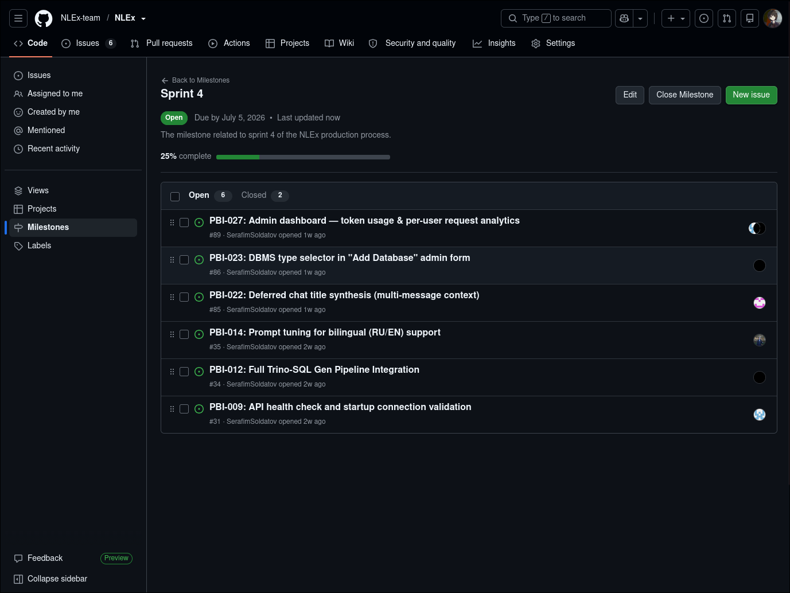
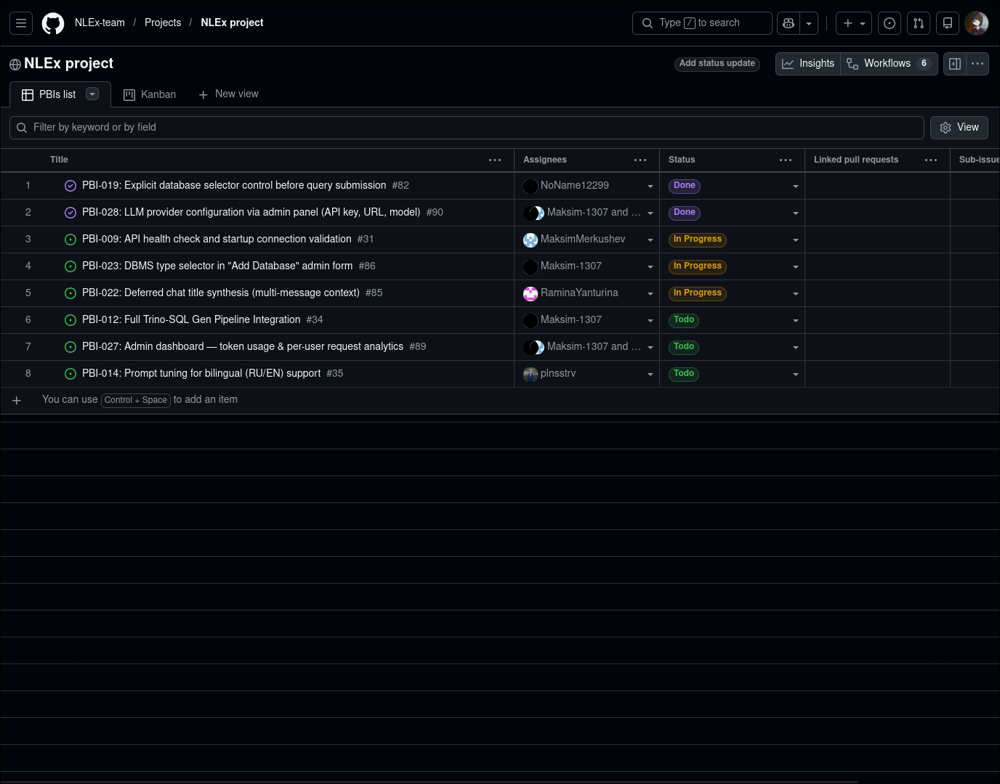
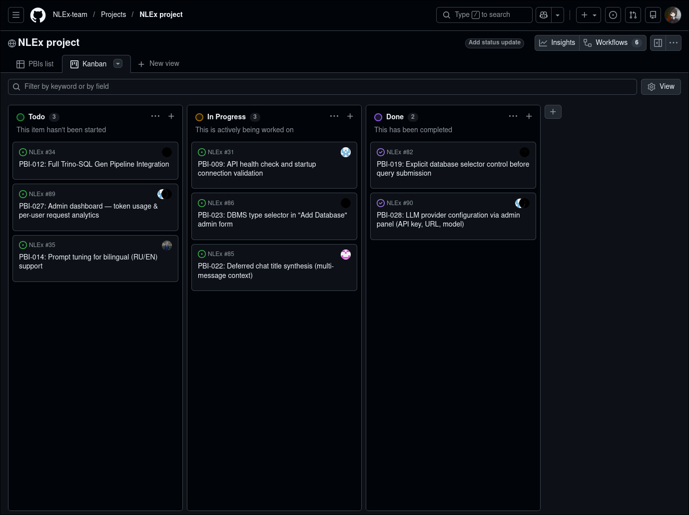
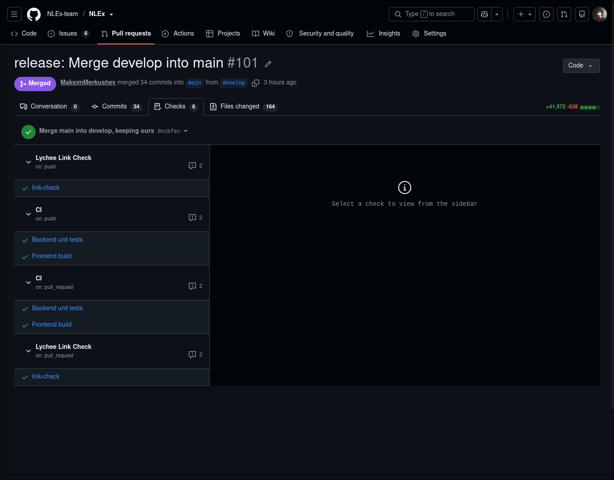
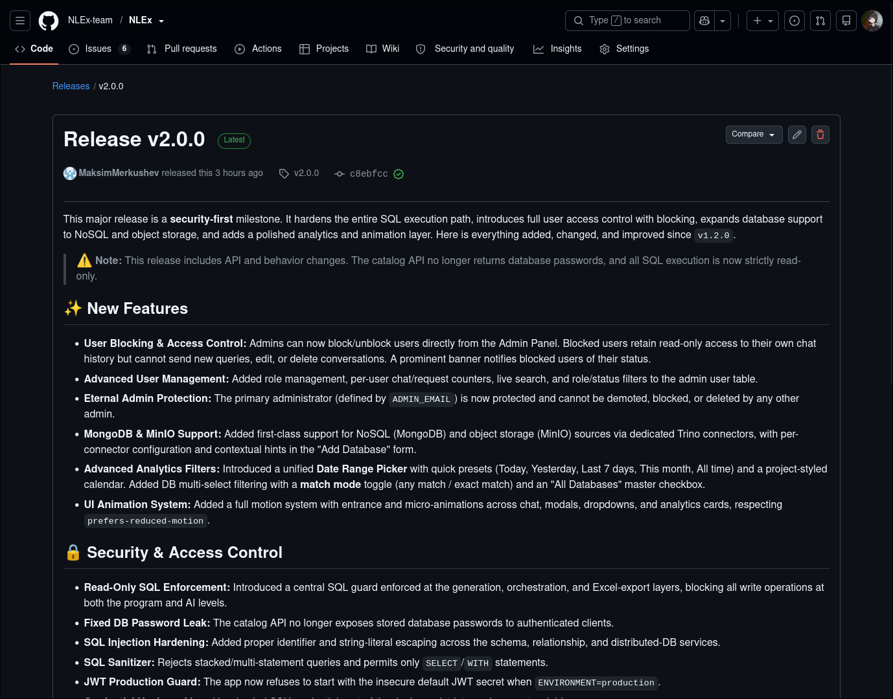

# Week 5 Report

**Project**: NLEx
**Description**: Natural Language to SQL service for business analysts.

## Links to Sprint Assets
- **Product Backlog**: https://github.com/orgs/NLEx-team/projects/1
- **Sprint 3 Milestone**: https://github.com/NLEx-team/NLEx/milestone/3
- **Sprint Goal**: Deliver MVP v2 including cross-database requests and the new admin panel, while formalizing the architecture.
- **Sprint Dates**: 2026-06-29 to 2026-07-05
- **Sprint Size**: 21 Story Points

## MVP v2 Summary
- **Delivered Changes**: Fully implemented cross-database requests and admin panel. History of requests is present.
- **Product Access Artifact**: [Link to Deployment]
- **Run Instructions**: See root [README.md](../../README.md)

## Customer Feedback Response
| Feedback point | Resulting PBI or issue | Status | Response |
|---|---|---|---|
| Filters in the analytics table and the user table | PBI-036 | New | Scheduled for next Sprint |
| More accurate analytics for a short period of time (week and day) | PBI-037 | New | Scheduled for next Sprint |
| Blocking account access via the admin panel | PBI-038 | New | Scheduled for next Sprint |
| Restrictions on queries directly in Sql | PBI-039 | New | Scheduled for next Sprint |
| Support for no sql databases: Mongo and minIO | PBI-040, PBI-041 | New | Scheduled for MVP v3 |

**Explanation of feedback not addressed:**
All requested features have been scheduled in the backlog as new PBIs. We did not address them in the current Sprint (MVP v2) because the feedback was provided during this Sprint's review session. Additionally, based on the customer's new direction, we have officially deprecated all previous template-related PBIs.

## Documentation Links
- [Roadmap](../../docs/roadmap.md)
- [Definition of Done](../../docs/definition-of-done.md)
- [Testing Strategy](../../docs/testing.md)
- [Quality Requirements](../../docs/quality-requirements.md)
- [Quality Requirement Tests](../../docs/quality-requirement-tests.md)
- [User Acceptance Tests](../../docs/user-acceptance-tests.md)
- [Development Process](../../docs/development-process.md)
- [Architecture README](../../docs/architecture/README.md)
  - [Static View](../../docs/architecture/static-view/component-diagram.md)
  - [Dynamic View](../../docs/architecture/dynamic-view/sequence-diagram.md)
  - [Deployment View](../../docs/architecture/deployment-view/deployment-diagram.md)
  - [ADR Index](../../docs/architecture/adr/)

## Architecture & Quality Summary
The architecture relies on Trino for distributed querying, FastAPI for backend routing, and React/Vite for the frontend. The deployment is managed via Docker Compose.
**Quality Requirements Linkage:** Quality requirements are explicitly supported by architecture decisions. For instance, Trino ensures Performance Efficiency (QR-001), the centralized FastAPI router with JWT middleware ensures Security (QR-002), and the Orchestrator State Machine protects against user errors by handling ambiguity (QR-003).

## Testing and CI Status
- Unit tests and integration tests are passing. QRTs remain active and passing.
- [CI Pipeline Link]
- [Latest CI Run Link]

## Releases & Demo
- **SemVer Release**: [v2.0.0 Release]
- **Changelog**: [CHANGELOG.md](../../CHANGELOG.md)
- **Public Demo Video**: [Link to Demo Video]
- **Hosted Documentation Site**: [Link to Docs Site]

## Sprint Review & Next Steps
- **UAT Results**: New UAT scenarios passed successfully.
- **Sprint Review Summary**: [sprint-review-summary.md](sprint-review-summary.md)
- **Sprint Review Notes**: [sprint-review-notes.md](sprint-review-notes.md) *(Transcript omitted due to laptop recording issue causing lack of sound. [Video Link](https://drive.google.com/file/d/1RQ0Lvp41GtW0Nbn_r8CdVpDEWLQUe91O/view?usp=sharing) is provided)*
- **Reflection**: [reflection.md](reflection.md)
- **Retrospective**: [retrospective.md](retrospective.md)
- **LLM Report**: [llm-report.md](llm-report.md)
- **Current Product Status**: MVP v2 is deployed and stable. All core functionality, cross-db requests, and admin panel are active.
- **Next Steps**: Focus on MVP v3 featuring NoSQL support (MongoDB, MinIO) and advanced admin panel capabilities.

## Contribution Traceability
| Team Member | Role | Responsibilities |
|---|---|---|
| Maksim Merkushev | Product Owner | Backlog refinement, customer communication, reviewed 2 PRs. |
| Serafim Soldatov | Scrum Master | Sprint management, reporting, CI/CD, updated process docs. |
| Maksim Maltsev | Developer | Feature implementation (cross-db UI), opened PR #40. |
| Polina Systerova | Developer | Feature implementation (admin panel UI), testing. |
| Ramina Ianturina | Developer | Feature implementation (chat history), opened PR #42. |
| Liubov Savchenko | Developer | Feature implementation (backend endpoints), architecture docs. |

## Screenshots
- **Sprint milestone**: 
- **Board/Kanban workflow view**:    
- **Latest default-branch CI run**: 
- **SemVer release**: 
- **Reviewed PR/MR**: .png)   .png)   .png)
- **Hosted docs site**: 
