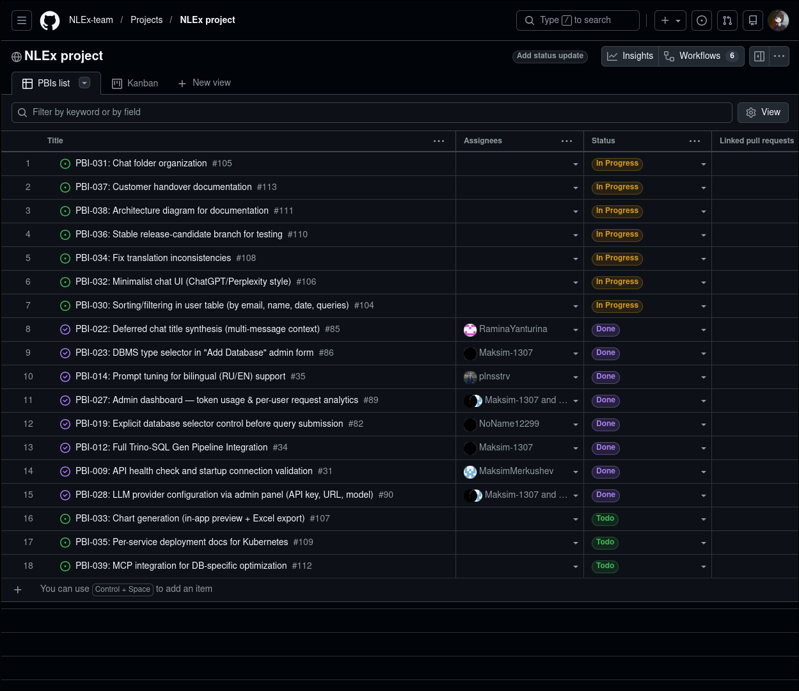
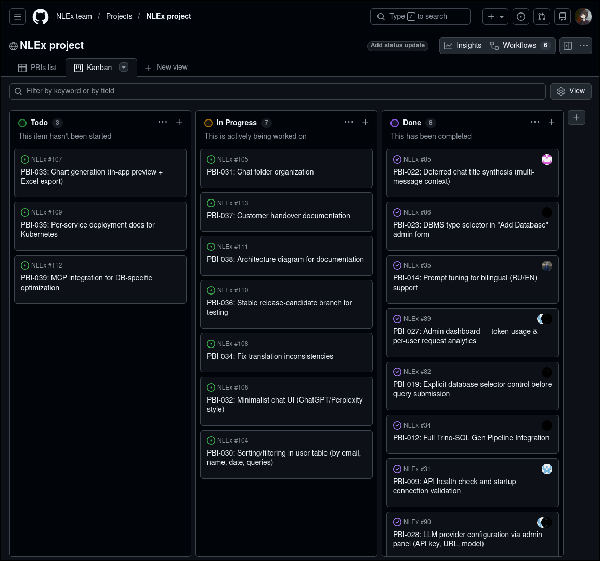
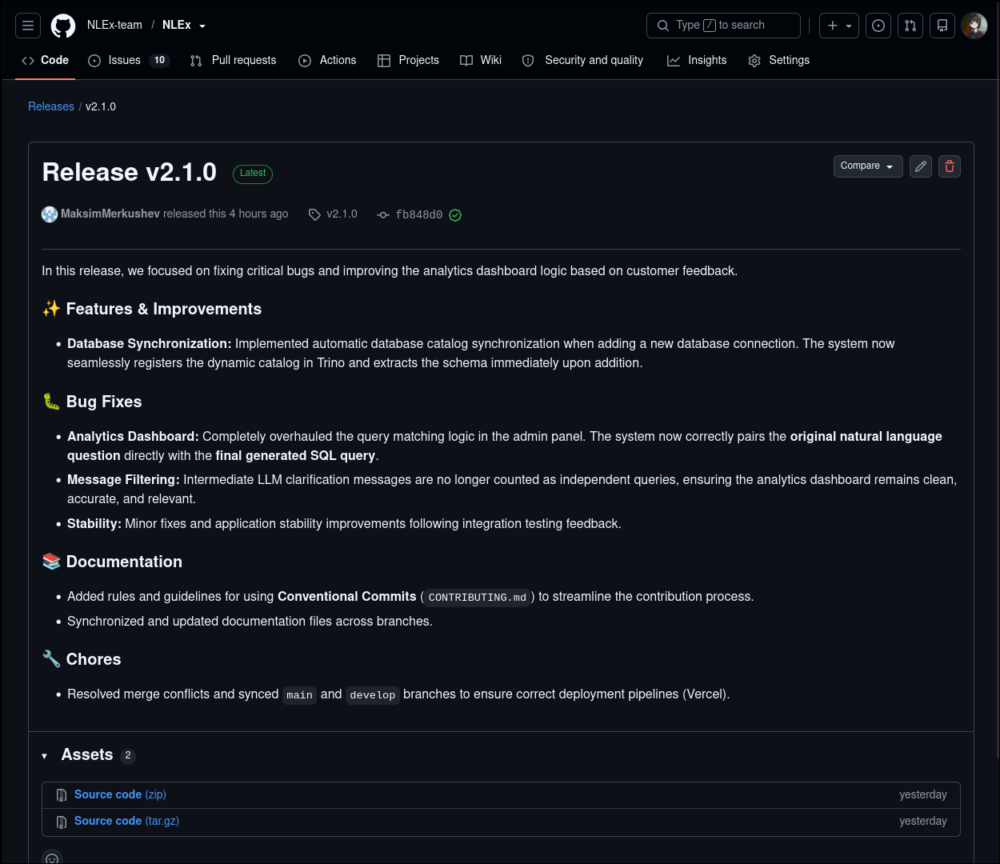
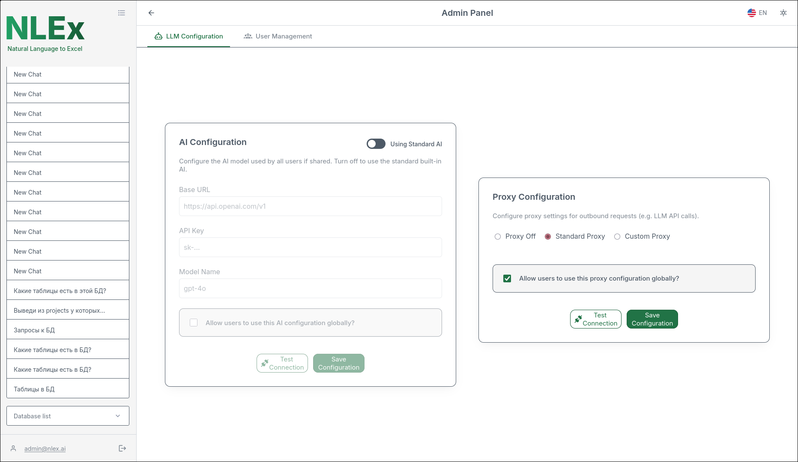
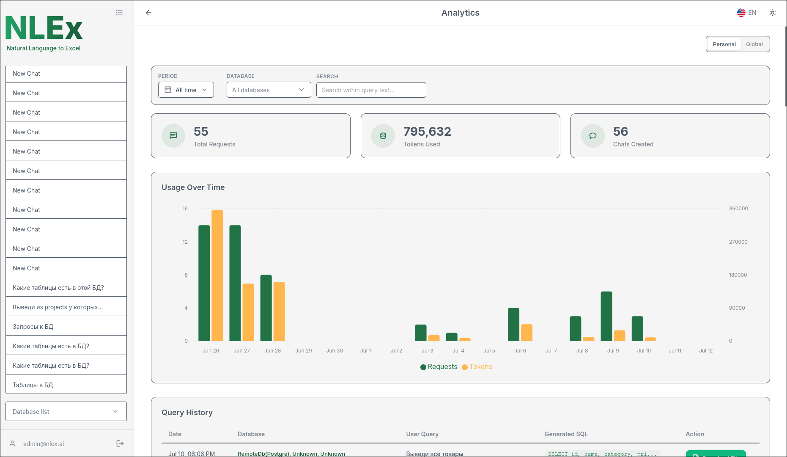

# Week 6 – Sprint 4 Report

## Project Overview

**Project Name**: NLEx — Natural Language Explorer
**Description**: NLEx is a web-based platform that enables non-technical users to query structured databases using natural language. Powered by LLMs and the Trino query engine, NLEx translates everyday questions into SQL queries across multiple database types.

---

## Sprint Backlog & Planning

- **Product Backlog Board**: [GitHub Projects Board](https://github.com/orgs/NLEx-team/projects/1)
- **Sprint 4 Backlog Board**: [Sprint 4 Board](https://github.com/orgs/NLEx-team/projects/1/views/1)
- **Sprint 4 Milestone**: [Sprint 4 Milestone](https://github.com/NLEx-team/NLEx/milestone/4)
- **Sprint 4 Goal**: Deliver a stable trial release with UX/UI improvements, admin panel enhancements, translation fixes, and customer-facing documentation, enabling the customer to independently deploy and test the product.
- **Sprint Dates**: June 6, 2026 – July 12, 2026
- **Total Story Points**: 29

---

## Sprint Scope Summary

Sprint 4 focused on addressing customer feedback from Sprint 3, improving UX/UI, preparing the product for customer trial deployment, and creating transition-readiness documentation.

### Key Deliverables:
- **Chat Folder Organization**: Users can now group chats into folders for better organization (e.g., separating traffic queries from company reports)
- **Admin User Table Filtering/Sorting**: Added filters for email, name, registration date, and query count with toggle-based sorting behavior
- **Minimalist Chat UI Redesign**: Chat interface redesigned following modern chatbot UX patterns (inspired by ChatGPT, Claude, Perplexity)
- **Translation Fixes**: Resolved inconsistencies such as "successfully" appearing in Russian-language UI
- **Stable Release-Candidate Branch**: Prepared a stable branch for customer independent testing
- **Per-Service Deployment Documentation**: Initial documentation for deploying individual services in Kubernetes/DevOps environments
- **Customer Handover Documentation**: Created `docs/customer-handover.md` with deployment, configuration, and transition guidance
- **Architecture Diagram**: Added architecture diagram to the hosted documentation site

---

## Product Access

- **Deployed Product**: [https://nlex.tech/](https://nlex.tech/)
- **Access/Run Instructions**: See [README.md](../../README.md) and [Hosted Documentation](https://nlex-team.github.io/NLEx/)

---

## Documentation Links

| Document | Link |
|----------|------|
| README.md | [README.md](../../README.md) |
| CONTRIBUTING.md | [CONTRIBUTING.md](../../CONTRIBUTING.md) |
| AGENTS.md | [AGENTS.md](../../AGENTS.md) |
| Customer Handover | [docs/customer-handover.md](../../docs/customer-handover.md) |
| Hosted Documentation | [GitHub Pages](https://nlex-team.github.io/NLEx/) |
| Roadmap | [docs/roadmap.md](../../docs/roadmap.md) |
| CHANGELOG.md | [CHANGELOG.md](../../CHANGELOG.md) |
| Quality Requirements | [docs/quality-requirements.md](../../docs/quality-requirements.md) |
| Quality Requirement Tests | [docs/quality-requirement-tests.md](../../docs/quality-requirement-tests.md) |
| Testing Strategy | [docs/testing.md](../../docs/testing.md) |
| Architecture | [docs/architecture/](../../docs/architecture/) |
| Development Process | [docs/development-process.md](../../docs/development-process.md) |
| Definition of Done | [docs/definition-of-done.md](../../docs/definition-of-done.md) |
| User Acceptance Tests | [docs/user-acceptance-tests.md](../../docs/user-acceptance-tests.md) |

---

## Customer-Facing Documentation Review Summary

During the Week 6 meeting, the customer reviewed the documentation set and provided the following assessment:

**What the customer found clear:**
- The Docker Compose deployment instructions were clear and allowed independent deployment without problems (customer confirmed: *"Last time I was sent the official instructions, everything was clear there, and I was able to deploy locally without any problems."*)
- The overall product documentation structure on GitHub Pages was acknowledged

**What the customer found unclear or missing:**
- **Per-service configuration documentation** is needed for Kubernetes/DevOps deployment. Docker Compose bundles all settings in a shared `.env` file, but for production clusters each microservice needs separate Deployment, ConfigMap, and Secrets documentation
- **Service interconnections** between frontend, backend, ML service, and databases need to be documented individually
- **Architecture diagram** requested to be added to the hosted documentation

**Customer quote**: *"I need an instruction on what settings are required for each service individually. In Kubernetes, each microservice is configured separately—Deployment, ConfigMap, Secrets. I need to understand what exactly the frontend needs, what the ML service needs, and what the connections are between them."*

---

## Transition-Readiness Summary

### Current State:
- The product is **feature-complete** for core use cases (NL-to-SQL translation, multi-database support, analytics, user management, i18n)
- The customer considers the product **"a solid solution"** based on the Week 6 demo
- The team-managed deployment at https://nlex.tech/ is accessible

### Blockers to Independent Customer Use:
1. **Stable branch not yet sent to customer** — the customer explicitly requested a release-candidate branch to deploy on their side. This was the primary reason they had not yet tested independently
2. **VPN certificate handling** — the customer needs to install VPN certificates into Docker images to access their production databases
3. **Per-service deployment documentation** — needed for production Kubernetes deployment

### What Must Happen in Week 7:
1. Send the stable release-candidate branch to the customer via Telegram
2. Support the customer's local deployment attempt
3. Complete per-service deployment documentation
4. Document VPN certificate installation for Docker images
5. Address any issues discovered during customer's production database testing
6. Deliver final `MVP v3` release
7. Obtain transition confirmation from customer

---

## Customer Feedback Response Table

| # | Feedback Point | Source | Action | PBI/Issue | Status |
|---|---------------|--------|--------|-----------|--------|
| 1 | Sorting/filtering in user table (by email, name, date, queries) | Week 5 meeting | Implemented in Sprint 4 | PBI-030 | ✅ Done |
| 2 | Chat folder organization | Week 5 meeting | Implemented in Sprint 4 | PBI-031 | ✅ Done |
| 3 | Minimalist chat UI (ChatGPT/Perplexity style) | Week 5 meeting | Implemented in Sprint 4 | PBI-032 | ✅ Done |
| 4 | Chart generation (in-app preview + Excel export) | Week 6 meeting | Created PBI for Sprint 5 | PBI-033 | 🔲 Planned |
| 5 | Fix translation inconsistencies | Week 5 meeting | Fixed in Sprint 4 | PBI-034 | ✅ Done |
| 6 | Per-service deployment docs for Kubernetes | Week 6 meeting | Started in Sprint 4, ongoing | PBI-035 | 🟡 In Progress |
| 7 | Stable release-candidate branch for testing | Week 5 meeting | Branch prepared | PBI-036 | ✅ Done |
| 8 | Customer handover documentation | Assignment 6 | Created in Sprint 4 | PBI-037 | ✅ Done |
| 9 | Architecture diagram for documentation | Week 6 meeting | Added in Sprint 4 | PBI-038 | ✅ Done |
| 10 | MCP integration for DB-specific optimization | Week 6 meeting | Acknowledged, deferred post-course | PBI-039 | ❌ Deferred |

### Feedback Not Yet Addressed:
- **Chart generation (PBI-033)**: This is a resource-intensive feature requiring double-check logic for Excel generation and a frontend preview component. It has been planned for Sprint 5 but may not be fully delivered depending on the effort required for customer deployment support and final transition work.
- **MCP integration (PBI-039)**: The customer suggested connecting MCP (Model Context Protocol) or a knowledge base for DB-specific query optimization. This was acknowledged as architecturally complex and not feasible within the course timeline. It has been documented as a post-course enhancement opportunity.
- **Per-service deployment docs (PBI-035)**: Initial documentation has been started but is not yet complete. Full per-service configuration with Kubernetes manifests is planned for Sprint 5.

---

## UAT Summary

| Scenario | Description | Result | Notes |
|----------|-------------|--------|-------|
| UAT-1 | Natural Language Query Execution | ✅ Passed | User asks a question in NL, gets correct SQL + results |
| UAT-2 | Multi-Database Connection and Query | ✅ Passed | ClickHouse, PostgreSQL, MongoDB queryable simultaneously |
| UAT-3 | Admin Analytics Dashboard | ✅ Passed | Filters by time, database, text match work correctly |
| UAT-4 | User Management | ✅ Passed | Roles, blocking, statistics visible |
| UAT-5 | Language Switching | ✅ Passed | EN/RU switching with translation fixes applied |
| UAT-6 | Chat Folder Organization | ✅ Passed | Folders created, chats grouped, root chats preserved |
| UAT-7 | Customer Independent Deployment | 🔲 Planned | Scheduled for Sprint 5 — customer will deploy locally |

The customer did not independently execute the trial release during Week 6. The customer confirmed intent to deploy and test during Week 7 after receiving the stable branch.

---

## Release

- **Week 6 Trial Release**: [v2.1.0](https://github.com/NLEx-team/NLEx/releases/tag/v2.1.0) — Sprint 4 trial/handover-candidate release for Assignment 6
- **Sprint 4 Milestone**: [Sprint 4](https://github.com/NLEx-team/NLEx/milestone/4)

---

## Sprint Review

- **Sprint Review Transcript**: The Sprint 4 Review was conducted during the same meeting as the customer trial and transition-readiness discussion. The full transcript is available at [customer-review-transcript.md](customer-review-transcript.md). A summary reference is at [sprint-review-transcript.md](sprint-review-transcript.md).

  > Publication of the Sprint Review transcript in the public repository was permitted by the customer.

- **Sprint Review Summary**: [sprint-review-summary.md](sprint-review-summary.md)

---

## Reflection, Retrospective & LLM Report

- **Reflection**: [reflection.md](reflection.md)
- **Retrospective**: [retrospective.md](retrospective.md)
- **LLM Usage Report**: [llm-report.md](llm-report.md)

---

## Current Product Status & Expected Week 7 Follow-up

### Current Status:
MVP v2+ (trial release v2.1.0) is deployed and functional with all core features, improved UX/UI, chat folders, admin filtering, and i18n fixes. The product is ready for customer independent testing.

### Expected Week 7 Work (Sprint 5):
1. **Customer deployment support**: Send stable branch, assist with local setup and VPN certificate configuration
2. **Chart generation**: Implement chart preview and Excel export if feasible
3. **Per-service documentation**: Complete Kubernetes deployment documentation with per-service ConfigMap/Secrets guidance
4. **Performance feedback**: Address issues from customer's production database testing
5. **Final transition**: Confirm handover level with customer, obtain acceptance
6. **MVP v3 release**: Create final SemVer release with all Sprint 5 changes
7. **Demo Day preparation**: Prepare presentation slides, record demo video

---

## Contribution Traceability

| Team Member | Role | Key Contributions (Sprint 4) | Testing & Review Activity |
|-------------|------|------------------------------|---------------------------|
| **Maksim Merkushev** | Product Owner | Backlog refinement, Cross-DB optimization planning, Sprint 4 goal alignment | LLM workflow testing, UAT scenario validation |
| **Serafim Soldatov** | Scrum Master | Customer handover docs (PBI-037), Week 6 reports, Stable release-candidate branch (PBI-036) | Backend tests, Repository review, Retrospective moderation |
| **Maksim Maltsev** | Developer | Admin User Table Filtering (PBI-030), Architecture diagram (PBI-038), Sprint review prep | Integration tests, Architecture review |
| **Polina Systerova** | Developer | Translation/i18n inconsistencies fix (PBI-034), Quality docs & UAT updates | UAT execution, i18n localization testing |
| **Ramina Ianturina** | Developer | Minimalist chat UI redesign (PBI-032), Frontend styling & layout improvements | Frontend component tests, UI/UX review |
| **Liubov Savchenko** | Developer | Chat Folder Organization (PBI-031), Per-service Kubernetes deployment docs (PBI-035) | Backend endpoint tests, API integration testing |

---

## Screenshots

### Backlog & Kanban Boards
* **Product Backlog**:
  
* **Sprint 4 Kanban Board**:
  

### Week 6 Trial Release
* **Semantic Versioning Trial Release (v2.1.0)**:
  

### Traceability: Issue-Linked PRs
* **PR Example 1**:
  
* **PR Example 2**:
  
* **PR Example 3**:
  

### Delivered Features UI
* **Main Dashboard & Chat Folder Organization**:
  
* **Admin User Table Filtering & Analytics**:
  
