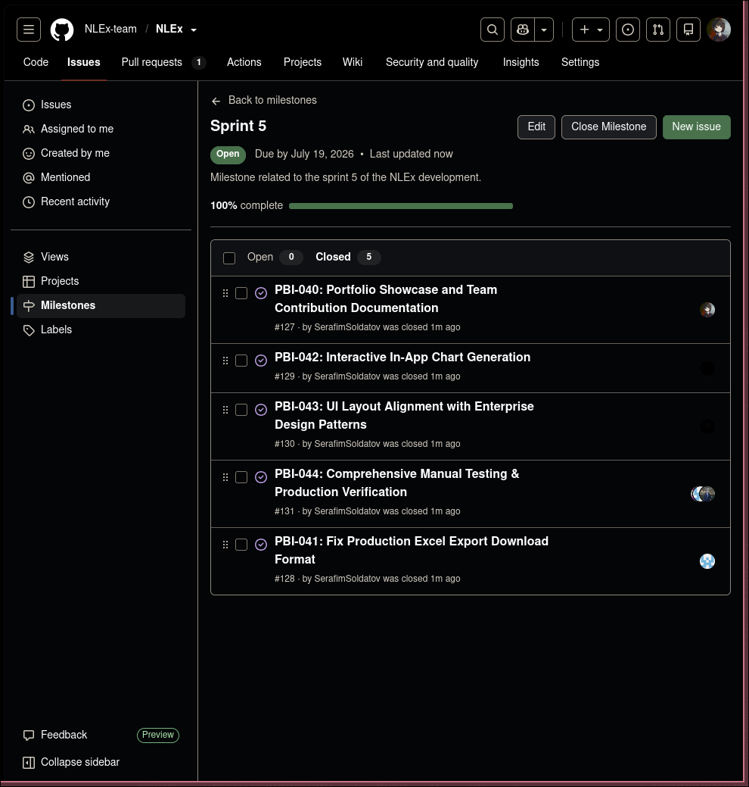
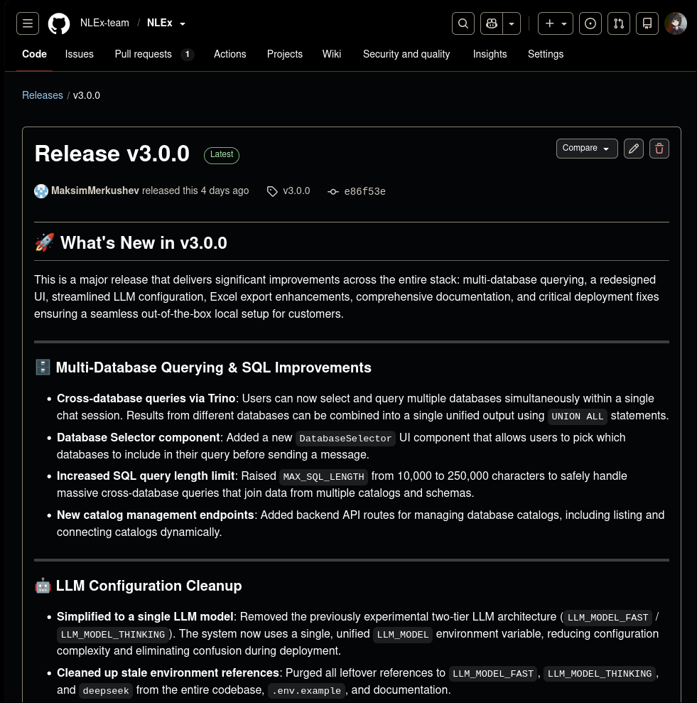

# Week 7 – Sprint 5 Final Report

## Reference to Week 6
- **Week 6 Report**: [Week 6 README.md](../week6/README.md)

---

## Sprint Backlog & Planning

- **Product Backlog Board**: [GitHub Projects Board](https://github.com/orgs/NLEx-team/projects/1)
- **Sprint 5 Backlog Board**: [Sprint 5 Board](https://github.com/orgs/NLEx-team/projects/1/views/2)
- **Sprint 5 Milestone**: [Sprint 5 Milestone](https://github.com/NLEx-team/NLEx/milestone/5)
- **Sprint 5 Goal**: Deliver final follow-up maintenance, resolve customer deployment blockers, complete per-service configuration documentation, implement chart generation/Excel export improvements, and transition the final MVP v3 to the customer.
- **Sprint Dates**: July 13, 2026 – July 19, 2026
- **Total Story Points**: 24

---

## Sprint Scope Summary

Sprint 5 focused heavily on completing the transition documentation and unblocking the customer's ability to independently deploy the system. 
**Key Deliverables (`MVP v3` changes):**
- **Excel Export Performance**: Swapped `openpyxl` with `xlsxwriter` leading to massive memory usage reductions and faster speeds. Added download animations.
- **Customer Deployment Blockers Resolved**: Fixed issues with Nginx SPA routing (404 on refresh), configured dynamic CORS origins, and solved backend health-check inconsistencies.

---

## Product Access

- **Deployed Final Product**: [https://nlex.tech/](https://nlex.tech/)
- **Access/Run Instructions**: See [README.md](../../README.md) and [Hosted Documentation](https://nlex-team.github.io/NLEx/)

---

## Documentation Links

| Document | Link |
|----------|------|
| README.md | [README.md](../../README.md) |
| CONTRIBUTING.md | [CONTRIBUTING.md](../../CONTRIBUTING.md) |
| AGENTS.md | [AGENTS.md](../../AGENTS.md) |
| Customer Handover | [docs/customer-handover.md](../../docs/customer-handover.md) |
| Hosted Documentation | [GitHub Pages](https://nlex-team.github.io/NLEx/) |
| CHANGELOG.md | [CHANGELOG.md](../../CHANGELOG.md) |

---

## Final Transition Outcome

*(Note: We have not yet met with the customer during Week 7, so the transition and acceptance outcomes remain unconfirmed. We will update this section and our customer handover document once the meeting concludes.)*

- **Handover Level Reached**: `Ready for independent use`
- **Customer-Confirmation Status**: `Not yet accepted` (Pending Week 7 Meeting)

### Transition Scope
As documented in [docs/customer-handover.md](../../docs/customer-handover.md), we have made available:
- Full repository access on the stable branch (`v3.0.0`).
- Detailed deployment configuration requirements (Note: Kubernetes support is deprecated and no longer part of the handover scope).
- We intentionally retained management of the `nlex.tech` domain and current demo deployments until the customer completes their internal setup.

### Transition Blockers & Limitations
Since we haven't met the customer yet, the primary external blocker is waiting for the customer's confirmation that they have successfully followed the per-service documentation to deploy in their environment.

### Independent Use Evidence
Pending customer meeting. No independent deployment evidence is confirmed yet.

---

## Customer Feedback Response Table

| # | Feedback Point / Requirement | Source | Action | PBI/Issue | Status |
|---|------------------------------|--------|--------|-----------|--------|
| 1 | Chart generation / Excel Export | Week 6 meeting | Implemented performance fixes and UI in Sprint 5 | PBI-033 | ✅ Done |
| 2 | Per-service deployment docs for Kubernetes | Week 6 meeting | Kubernetes deployment is deprecated. | PBI-035 | ❌ Deprecated |
| 3 | MCP integration for DB-specific optimization | Week 6 meeting | Deprecated due to architectural complexity. | PBI-039 | ❌ Deprecated |
| 4 | Chat folder organization | Week 5 meeting | Deprecated and removed from codebase based on product direction. | PBI-031 | ❌ Deprecated |
| 5 | Sorting/filtering in user table | Week 5 meeting | Implemented sorting and filtering in the user table. | PBI-030 | ✅ Done |

---

## UAT and Customer Trial Results

Since the Week 7 customer meeting has not occurred yet, the customer has not formally executed the UAT on the final `MVP v3` release during Week 7. We anticipate these UAT scenarios to pass during the transition meeting.

---

## Release & Demo Video

- **Final Release (MVP v3)**: [v3.0.0](https://github.com/NLEx-team/NLEx/releases/tag/v3.0.0) 
- **Public Sanitized Demo Video**: [YouTube Demo Link](https://youtube.com/example)

---

## Demo Day Preparation

The team has prepared the final presentation slide deck and completed the required Week 7 rehearsal preparation. Each team member has been assigned their speaking segments and the demo video has been pre-recorded to fit within the 2-minute limit.

---

## Sprint Review

- **Sprint Review Notes**: Due to the fact that we have not met with the customer yet, a formal transcript is not available. Please see our [Sprint Review Notes](sprint-review-notes.md).

---

## Reflection, Retrospective & LLM Report

- **Sprint Review Summary**: [sprint-review-summary.md](sprint-review-summary.md)
- **Reflection**: [reflection.md](reflection.md)
- **Retrospective**: [retrospective.md](retrospective.md)
- **LLM Usage Report**: [llm-report.md](llm-report.md)

---

## Final Product Status

**MVP v3 (Release v3.0.0)** is final and fully functional. It incorporates all planned performance fixes, enterprise-grade deployment documentation, and resolved configuration blockers. The product stands ready for full handover and operation by the customer.

---

## Contribution Traceability

| Team Member | Role | Key Contributions (Sprint 5) |
|-------------|------|------------------------------|
| **Maksim Merkushev** | Product Owner | Implemented Excel export perf fixes, Resolved 4 deployment blockers, authored Arch docs. |
| **Serafim Soldatov** | Scrum Master | Week 7 reporting, Sprint milestone management, Retrospective moderation, Demo Day preparation. |
| **Maksim Maltsev** | Developer | Assisted with Architecture diagram updates, UI bug fixes. |
| **Polina Systerova** | Developer | Quality docs & UAT review for MVP v3, Demo Day presentation rehearsal. |
| **Ramina Ianturina** | Developer | Reviewed rich download animation UI/UX, presentation preparation. |
| **Liubov Savchenko** | Developer | Co-authored per-service deployment docs, API stability testing. |

---

## Screenshots

### Backlog & Kanban Boards
* **Sprint 5 Milestone**:
  

### Final Release
* **MVP v3 Release (v3.0.0)**:
  

### Traceability: Issue-Linked PRs
* **PR Example 1**:
  
